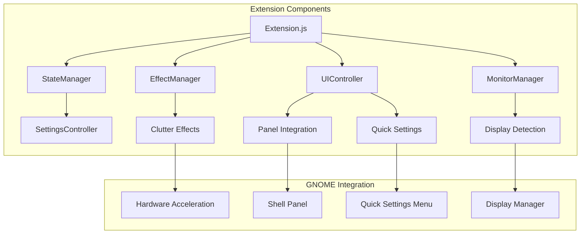

# Grayscale Toggle - GNOME Shell Extension

> **Transform your workflow**: A sophisticated GNOME Shell extension that
> provides system-wide grayscale toggle functionality for enhanced focus,
> reduced digital distraction, and improved productivity across multi-monitor
> setups.

## 🎯 Project Overview

This extension combines digital wellness principles with technical excellence to
deliver a comprehensive grayscale solution for GNOME Desktop environments. Based
on research from PMC studies showing that smartphone grayscale modes can reduce
dopamine-driven usage and improve focus, this extension brings those benefits to
your entire desktop experience.

**Key Benefits:**

- **Enhanced Focus**: Reduce visual distractions and dopamine triggers from
  colorful interfaces
- **Digital Wellness**: Scientific approach to managing screen time and
  attention
- **Productivity Boost**: Maintain concentration during focused work sessions
- **Multi-Monitor Excellence**: Professional-grade support for complex display
  setups
- **Seamless Integration**: Native GNOME Shell UI patterns and modern design

## ✨ Features

### 🔧 Core Functionality (Phase 1)

- **System-wide Grayscale Toggle**: Apply sophisticated desaturation effects
  across all displays
- **Keyboard Shortcuts**: Quick toggle with customizable hotkeys (default:
  [`Super+G`])
- **State Persistence**: Remembers preferences across sessions and reboots
- **Hardware Acceleration**: Utilizes
  [`Clutter.DesaturateEffect`](src/effectManager.ts) for smooth performance
- **Robust Settings**: Comprehensive configuration via GSettings schema

### 🖥️ Multi-Monitor Support (Phase 2)

- **Advanced Monitor Detection**: Intelligent display discovery and management
- **Real-time Hotplug Handling**: Seamless adaptation to display changes during
  runtime
- **Per-Monitor Control**: Independent grayscale state for each connected
  display
- **Dynamic Configuration**: Automatic adaptation to resolution changes and
  display reordering
- **Professional Display Management**: Support for complex multi-monitor
  workflows

### 🎨 Modern UI Integration (Phase 3)

- **Quick Settings Integration**: Native toggle in GNOME Shell 46+ Quick
  Settings panel
- **Panel Indicator**: Elegant top panel integration with comprehensive status
  display
- **Advanced Preferences**: Full-featured configuration dialog with real-time
  preview
- **Notification System**: Optional status notifications with customizable
  timeout
- **Animation Controls**: Smooth transitions with configurable duration and
  quality

### ⚡ Performance & Customization

- **Effect Quality Settings**: Multiple quality levels for different hardware
  capabilities
- **Performance Mode**: Optimizations for lower-end systems
- **Intensity Control**: Adjustable grayscale intensity from subtle to complete
  desaturation
- **Animation Tuning**: Configurable transition timing and easing curves
- **Resource Efficiency**: Minimal CPU and memory footprint

## 🔬 Research Foundation

This extension implements evidence-based digital wellness principles:

> _"Smartphone features like grayscale displays can reduce the reward value of
> the device and may help some users better self-regulate their usage."_ - PMC
> Digital Wellness Research

The extension translates these mobile device insights to desktop computing,
enabling:

- Reduced dopamine stimulation from colorful interfaces
- Improved focus during concentrated work sessions
- Better control over digital consumption habits
- Enhanced productivity in distraction-prone environments

## 🚀 2024 Modernization Achievements

**This extension has undergone comprehensive modernization**, transforming from
a JavaScript codebase to a **professional TypeScript extension with
enterprise-grade architecture**:

### ⚡ Modern Development Foundation

- **Complete TypeScript Migration**: Full type safety with strict TypeScript
  configuration
- **Professional Tooling**: ESLint, Prettier, Jest, and modern development
  workflow
- **Automated Quality Assurance**: Pre-commit hooks, lint-staged, and
  comprehensive validation
- **Node.js LTS Support**: Uses Node.js 24 "Krypton" LTS for maximum stability

### 🏗️ Enterprise-Grade Architecture

- **Component-Based Design**: Modular architecture with dependency injection
  patterns
- **Infrastructure Layer**: Professional components for logging, error handling,
  and performance monitoring
- **Resource Management**: Advanced object pooling and memory optimization
- **Error Recovery**: Comprehensive error boundaries with automatic recovery
  strategies

### 🔄 Comprehensive CI/CD Pipeline

- **Automated Testing**: Jest test suite with performance and integration
  testing
- **Quality Gates**: Automated linting, formatting, and TypeScript compilation
  checks
- **Release Automation**: Semantic versioning with automated changelog
  generation
- **Security Scanning**: Dependency vulnerability monitoring and updates

### 📊 Developer Experience Benefits

- **IntelliSense Support**: Full IDE integration with type definitions and
  auto-completion
- **Hot Reloading**: Streamlined development workflow with instant feedback
- **Professional Debugging**: Enhanced error reporting with stack traces and
  context
- **Collaborative Development**: GitHub workflows optimized for team
  contributions

### 🛠️ Infrastructure Components

- [`BaseComponent`](src/infrastructure/BaseComponent.ts): Foundation for all
  extension components
- [`ComponentRegistry`](src/infrastructure/ComponentRegistry.ts): Dependency
  injection and service management
- [`SignalManager`](src/infrastructure/SignalManager.ts): Advanced GNOME Shell
  signal handling
- [`EffectPool`](src/infrastructure/EffectPool.ts): High-performance resource
  pooling
- [`ErrorBoundary`](src/infrastructure/ErrorBoundary.ts): Comprehensive error
  handling
- [`PerformanceMonitor`](src/infrastructure/PerformanceMonitor.ts): Real-time
  performance metrics

## 📋 System Requirements

**Supported Environments:**

- **GNOME Shell**: Version 46.0 or later
- **Session Type**: Wayland (recommended) or X11
- **Architecture**: x86_64, aarch64
- **Operating System**: Ubuntu 24.04 LTS, Fedora 40+, openSUSE, Arch Linux

**Hardware Requirements:**

- **Graphics**: Any modern GPU with Clutter support
- **Memory**: 512MB+ available RAM
- **Display**: Single or multi-monitor configurations supported

**Development Dependencies:**

- [`gjs`](https://gitlab.gnome.org/GNOME/gjs) runtime (1.80.2+)
- [`gobject-introspection`](https://gitlab.gnome.org/GNOME/gobject-introspection)
  libraries
- [`glib`](https://gitlab.gnome.org/GNOME/glib) development tools

## 🚀 Quick Installation

### Method 1: One-Command Installation (Recommended) 🔥

**Material Shell-inspired convenience - just like the pros use!**

```bash
# Clone and install everything in one go
git clone https://github.com/webaheadstudios/grayscale-gnome-extension.git
cd grayscale-gnome-extension
npm install
npm run dev:install
```

**What this does:**
- ✅ Builds the extension automatically
- ✅ Creates development symlink for easy updates
- ✅ Compiles GSettings schemas
- ✅ Installs and enables the extension
- ✅ Provides helpful status messages

### Method 2: GNOME Extensions Website

```bash
# Visit extensions.gnome.org and install "Grayscale Toggle"
# Enable via GNOME Extensions app or command line
gnome-extensions enable grayscale-toggle@webaheadstudios.com
```

### Method 3: Advanced npm Commands

Our modern build system provides comprehensive installation commands:

```bash
# Development workflow
npm run dev:install          # One-command dev setup
npm run extension:status     # Check installation status

# Production installation
npm run install:extension    # Install from built package
npm run install:prod         # Build production + install

# Management commands
npm run enable:extension     # Enable extension
npm run disable:extension    # Disable extension
npm run uninstall:extension  # Complete removal

# Quick development cycle
npm run dev:uninstall       # Quick uninstall for testing
npm run build:dev           # Rebuild for development
```

### Developer Benefits 🛠️

This installation system provides the same level of convenience as Material Shell:

- **One-Command Setup**: `npm run dev:install` does everything you need
- **Cross-Platform**: Works on all Linux distributions with GNOME
- **Status Management**: Easy checking with `npm run extension:status`
- **Error Handling**: Clear error messages and recovery instructions
- **Development Focus**: Symlinked installation for easy source updates

## 📚 Usage Guide

### Basic Controls

- **Toggle Grayscale**: Press [`Super+G`] or click the panel indicator
- **Quick Settings**: Use the toggle in GNOME Quick Settings panel
- **Panel Menu**: Right-click panel indicator for advanced options

### Multi-Monitor Configuration

1. Open **Extensions** → **Grayscale Toggle** → **Preferences**
2. Enable **"Per-monitor mode"** for independent display control
3. Configure each monitor individually via panel menu
4. Adjust **hotplug behavior** for dynamic display changes

### Customization Options

- **Keyboard Shortcuts**: Customize via Extensions preferences
- **Effect Intensity**: Adjust grayscale strength (0.0 - 1.0)
- **Animation Duration**: Control transition timing (0-2000ms)
- **Quality Settings**: Balance performance vs. visual quality
- **UI Integration**: Toggle panel indicator and Quick Settings visibility

## 🏗️ Architecture Overview



**Component Responsibilities:**

- **[`extension.ts`](src/extension.ts)**: Main lifecycle and component
  coordination
- **[`stateManager.ts`](src/stateManager.ts)**: Settings persistence and state
  synchronization
- **[`effectManager.ts`](src/effectManager.ts)**: Hardware-accelerated effect
  application
- **[`monitorManager.ts`](src/monitorManager.ts)**: Multi-monitor detection and
  hotplug handling
- **[`uiController.ts`](src/uiController.ts)**: Panel indicator and Quick
  Settings integration

## 🛠️ Modern TypeScript Development

### Prerequisites

```bash
# Install Node.js LTS (Krypton - v24.x)
curl -fsSL https://deb.nodesource.com/setup_lts.x | sudo -E bash -
sudo apt-get install -y nodejs

# Install development dependencies
sudo apt update && sudo apt install -y \
    gnome-shell-extensions \
    gjs \
    libglib2.0-dev \
    gettext \
    glib-compile-schemas
```

### Development Setup

```bash
# Clone and setup
git clone https://github.com/webaheadstudios/grayscale-gnome-extension.git
cd grayscale-gnome-extension

# Install development dependencies
npm install

# Run quality checks
npm run compile     # TypeScript compilation
npm run lint        # ESLint validation
npm run test        # Jest test suite
npm run build       # Build extension package

# Enable development mode
export GNOME_SHELL_DEVELOPMENT=true

# Install and test locally
make install-dev
gnome-extensions enable grayscale-toggle@webaheadstudios.com
```

### Development Workflow

```bash
# Automated quality checks (pre-commit hooks)
npm run validate        # Run all checks
npm run compile        # TypeScript compilation
npm run lint           # ESLint validation
npm run format         # Prettier code formatting
npm run test           # Jest test suite
npm run test:watch     # Watch mode testing

# Build and packaging
npm run build          # Development build
npm run build:prod     # Production build
npm run clean          # Clean build artifacts

# Extension management
npm run install-dev    # Install to GNOME
npm run uninstall      # Remove extension
npm run restart-shell  # Restart GNOME Shell (X11)
```

### Quality Assurance

- **TypeScript Compilation**: Strict type checking with zero errors
- **ESLint**: Comprehensive code quality and standards validation
- **Jest Testing**: Unit, integration, and performance test coverage
- **Prettier**: Automated code formatting and consistency
- **Pre-commit Hooks**: Automated validation before commits
- **CI/CD Pipeline**: Comprehensive quality gates on all contributions

### Testing Framework

- **Unit Tests**: Component isolation with comprehensive mocking
- **Integration Tests**: Full extension lifecycle validation
- **Performance Tests**: Memory usage and animation performance
- **Architecture Tests**: Infrastructure component validation
- **E2E Testing**: Real GNOME Shell environment testing

### Contributing

1. **Fork the repository** and clone your fork
2. **Install dependencies**: `npm install`
3. **Create feature branch**: `git checkout -b feature/enhanced-effects`
4. **Follow TypeScript standards** with full type annotations
5. **Add comprehensive tests** for new functionality
6. **Use conventional commits**: `feat: add advanced effect transitions`
7. **Submit pull request** with detailed description

**Quality Requirements:**

- All TypeScript must compile without errors
- Tests must maintain 80%+ coverage
- ESLint validation must pass
- Prettier formatting must be applied
- Pre-commit hooks must pass

See [`CONTRIBUTING.md`](CONTRIBUTING.md) for complete development guidelines.

## 📁 Modern Project Structure

```
grayscale-gnome-extension/
├── src/                           # TypeScript source code
│   ├── extension.ts              # Main extension lifecycle
│   ├── metadata.json             # Extension metadata
│   ├── ambient.d.ts              # Global type declarations
│   ├── types/                    # TypeScript definitions
│   │   ├── index.ts              # Central type exports
│   │   ├── extension.ts          # Extension interfaces
│   │   ├── effects.ts            # Effect system types
│   │   ├── monitors.ts           # Multi-monitor types
│   │   ├── settings.ts           # Configuration types
│   │   ├── state.ts              # State management
│   │   ├── ui.ts                 # UI component types
│   │   ├── events.ts             # Event system types
│   │   └── infrastructure.ts     # Infrastructure types
│   ├── infrastructure/           # Enterprise architecture
│   │   ├── index.ts              # Infrastructure exports
│   │   ├── BaseComponent.ts      # Component foundation
│   │   ├── ComponentRegistry.ts  # Dependency injection
│   │   ├── SignalManager.ts      # Signal handling
│   │   ├── EffectPool.ts         # Resource pooling
│   │   ├── ErrorBoundary.ts      # Error handling
│   │   ├── Logger.ts             # Logging system
│   │   ├── ConfigCache.ts        # Configuration cache
│   │   └── PerformanceMonitor.ts # Performance metrics
│   ├── enhanced/                 # Enhanced components
│   │   └── EnhancedEffectManager.ts # Advanced effects
│   ├── tests/                    # Test infrastructure
│   │   ├── setup.ts              # Jest setup
│   │   ├── ArchitectureValidator.ts # Component tests
│   │   ├── infrastructure.test.ts   # Infrastructure tests
│   │   └── performance.test.ts      # Performance tests
│   ├── stateManager.ts           # Settings and state
│   ├── effectManager.ts          # Hardware effects
│   ├── monitorManager.ts         # Multi-monitor support
│   ├── uiController.ts           # UI coordination
│   ├── panelIndicator.ts         # Panel integration
│   ├── quickSettingsIntegration.ts # Quick Settings
│   ├── settingsController.ts     # Configuration
│   └── prefs.ts                  # Preferences dialog
├── .github/                      # GitHub automation
│   ├── workflows/                # CI/CD pipelines
│   │   ├── ci.yml               # Pull request validation
│   │   ├── main.yml             # Main branch QA
│   │   ├── release.yml          # Release automation
│   │   └── dependencies.yml     # Dependency management
│   ├── ISSUE_TEMPLATE/          # Issue templates
│   └── PULL_REQUEST_TEMPLATE.md # PR template
├── scripts/                      # Build automation
│   ├── build.js                 # Build system
│   ├── generate-docs.js         # Documentation
│   ├── update-metadata-version.js # Version sync
│   └── validate-metadata.js    # Metadata validation
├── schemas/                      # GSettings configuration
├── po/                           # Internationalization
├── docs/                         # Documentation
├── .husky/                       # Git hooks
├── dist/                         # Build output
├── coverage/                     # Test coverage reports
├── package.json                  # Node.js dependencies
├── tsconfig.json                 # TypeScript configuration
├── eslint.config.js              # ESLint rules
├── jest.config.js                # Jest testing config
├── .prettierrc                   # Prettier formatting
├── .editorconfig                 # Editor configuration
├── .node-version                 # Node.js version spec
├── .lintstagedrc.json           # Pre-commit config
├── .releaserc.json              # Release config
├── CHANGELOG.md                  # Version history
├── CONTRIBUTING.md               # Development guidelines
├── LICENSE                       # GPL-3.0 license
├── build.sh                      # Build script
└── README.md                     # This file
```

## 🔧 Configuration

### Available Settings

| Setting                | Type         | Default        | Description                 |
| ---------------------- | ------------ | -------------- | --------------------------- |
| `grayscale-enabled`    | Boolean      | `false`        | Global grayscale state      |
| `toggle-keybinding`    | String Array | `["<Super>g"]` | Keyboard shortcut           |
| `show-panel-indicator` | Boolean      | `true`         | Panel indicator visibility  |
| `panel-position`       | String       | `"right"`      | Panel indicator position    |
| `show-quick-settings`  | Boolean      | `true`         | Quick Settings integration  |
| `animation-duration`   | Number       | `300`          | Transition duration (ms)    |
| `grayscale-intensity`  | Double       | `1.0`          | Effect intensity (0.0-1.0)  |
| `effect-quality`       | String       | `"high"`       | Rendering quality level     |
| `per-monitor-mode`     | Boolean      | `false`        | Independent monitor control |
| `performance-mode`     | Boolean      | `false`        | Performance optimizations   |

### Advanced Configuration

- **GSettings CLI**:
  `gsettings set org.gnome.shell.extensions.grayscale-toggle <key> <value>`
- **dconf Editor**: Navigate to `/org/gnome/shell/extensions/grayscale-toggle/`
- **Preferences UI**: Extensions app → Grayscale Toggle → Preferences

## 🏆 Performance Characteristics

**System Impact:**

- **Memory Usage**: ~2-5MB additional RAM usage
- **CPU Overhead**: <1% during animations, ~0.1% at idle
- **Graphics Performance**: Hardware-accelerated with no frame rate impact
- **Battery Impact**: Negligible power consumption increase

**Optimization Features:**

- **Lazy Loading**: Components initialized only when needed
- **Event Batching**: Efficient handling of rapid display changes
- **Resource Cleanup**: Complete memory cleanup on extension disable
- **Caching**: Intelligent state and configuration caching

## 🐛 Troubleshooting

### Common Issues

**Extension won't enable:**

```bash
# Check GNOME Shell version compatibility
gnome-shell --version

# Verify installation
gnome-extensions list | grep grayscale-toggle

# Check for conflicts
journalctl -f -o cat /usr/bin/gnome-shell | grep -i grayscale
```

**Grayscale effect not applying:**

```bash
# Verify graphics support
glxinfo | grep "OpenGL"

# Reset to defaults
gsettings reset-recursively org.gnome.shell.extensions.grayscale-toggle

# Test in safe mode
gnome-shell --test-mode
```

**Multi-monitor issues:**

```bash
# Check monitor detection
xrandr --listmonitors

# Monitor hotplug testing
gnome-extensions prefs grayscale-toggle@webaheadstudios.com
```

See [`docs/installation-guide.md`](docs/installation-guide.md) for comprehensive
troubleshooting procedures.

## 📄 License

This project is licensed under the **GNU General Public License v3.0**
([GPL-3.0](LICENSE)) - the same license used by GNOME Shell and other GNOME
ecosystem projects.

**Key License Points:**

- ✅ Free to use, modify, and distribute
- ✅ Source code must remain open
- ✅ Derivative works must use GPL-3.0
- ✅ Commercial usage permitted

## 🤝 Community & Support

### Getting Help

- **Documentation**: Complete guides in [`docs/`](docs/) directory
- **Issues**: Report bugs and feature requests via
  [GitHub Issues](https://github.com/webaheadstudios/grayscale-gnome-extension/issues)
- **Discussions**: Community support via
  [GitHub Discussions](https://github.com/webaheadstudios/grayscale-gnome-extension/discussions)
- **IRC**: `#gnome-extensions` on
  [irc.gnome.org](https://wiki.gnome.org/Community/GettingInTouch/IRC)

### Contributing

We welcome contributions from the community! See our
[contributing guidelines](CONTRIBUTING.md) for:

- 🐛 Bug fixes and improvements
- ✨ New feature development
- 📖 Documentation enhancements
- 🧪 Testing and quality assurance
- 🌍 Translation and localization

## 🙏 Acknowledgments

This extension builds upon the excellent foundation provided by:

- **GNOME Shell Extension APIs** - Robust extension framework
- **Clutter Graphics Library** - Hardware-accelerated effects
- **GLib/GObject** - Configuration and state management
- **Digital Wellness Research** - Scientific basis for grayscale benefits
- **GNOME Community** - Development guidance and best practices

Special thanks to early testers and contributors who helped refine the
multi-monitor support and user interface design.

---

**Ready to enhance your digital wellness and productivity?**
[Install now](#-quick-installation) and experience the benefits of a
distraction-free computing environment with professional-grade multi-monitor
support.
