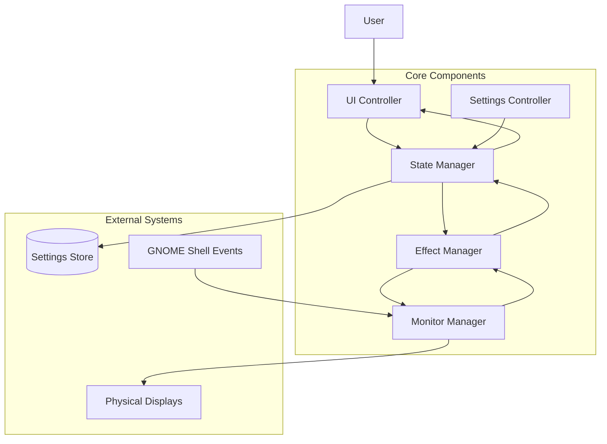
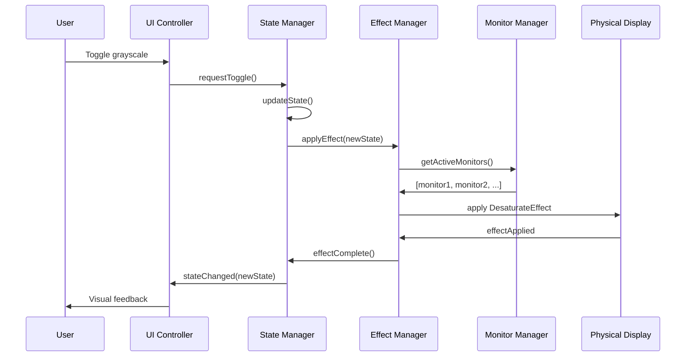
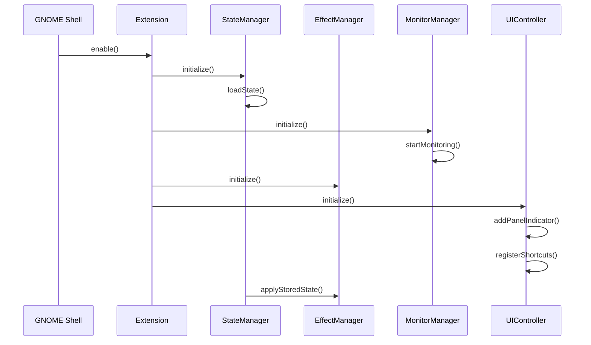
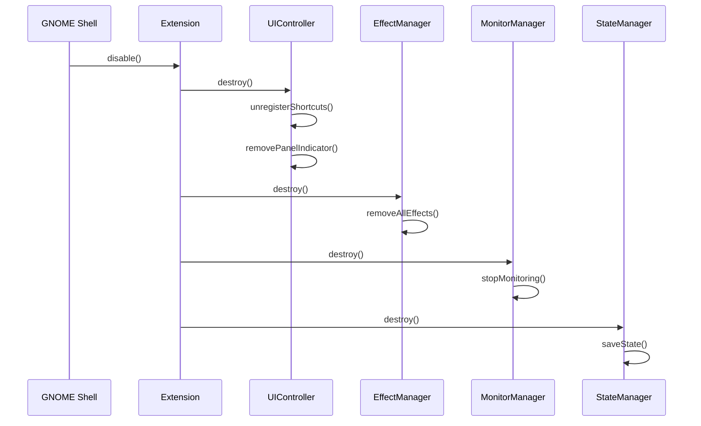

# Grayscale GNOME Extension - System Architecture Design

## Overview

This document defines the complete architecture for a GNOME Shell extension that provides system-wide grayscale toggle functionality across all monitors. The design prioritizes performance, reliability, and maintainability while following modern GNOME Shell 46.0+ development patterns.

## Executive Summary

The extension implements a modular architecture with five core components that manage state, effects, monitors, UI interactions, and settings. The design uses `Clutter.DesaturateEffect` for optimal performance and follows the modern ES6 module pattern introduced in GNOME Shell 45+.

## System Architecture

### High-Level System Overview



### Component Responsibilities

| Component | Primary Responsibility | Secondary Responsibilities |
|-----------|----------------------|---------------------------|
| **State Manager** | Central state coordination | Event distribution, lifecycle management |
| **Effect Manager** | Clutter effects per monitor | Performance optimization, effect transitions |
| **Monitor Manager** | Multi-monitor handling | Hotplug events, display configuration |
| **UI Controller** | User interface integration | Shortcuts, notifications, panel integration |
| **Settings Controller** | Preferences management | Schema validation, configuration persistence |

### Data Flow Architecture



## Core Component Specifications

### 1. State Manager (`StateManager`)

**Purpose**: Centralized state management and coordination hub

**Interface**:
```javascript
class StateManager {
    constructor(extension)
    
    // State operations
    getGrayscaleState() → boolean
    setGrayscaleState(enabled) → void
    toggleGrayscaleState() → boolean
    
    // Monitor-specific state
    getMonitorState(monitorIndex) → boolean
    setMonitorState(monitorIndex, enabled) → void
    
    // Persistence
    saveState() → void
    loadState() → void
    
    // Event system
    connect(signal, callback) → signalId
    disconnect(signalId) → void
    emit(signal, ...args) → void
    
    // Lifecycle
    initialize() → void
    destroy() → void
}
```

**Signals**:
- `state-changed` → (globalState: boolean)
- `monitor-state-changed` → (monitorIndex: number, state: boolean)
- `settings-changed` → (settingsKey: string, value: any)

**State Schema**:
```javascript
{
    global: {
        enabled: boolean,
        lastToggleTime: number
    },
    monitors: {
        [monitorIndex]: {
            enabled: boolean,
            effectActive: boolean
        }
    },
    settings: {
        autoEnable: boolean,
        animationDuration: number,
        keyboardShortcut: string[],
        perMonitorMode: boolean
    }
}
```

### 2. Effect Manager (`EffectManager`)

**Purpose**: Manages Clutter.DesaturateEffect application and lifecycle

**Interface**:
```javascript
class EffectManager {
    constructor(stateManager, monitorManager)
    
    // Effect lifecycle
    applyGlobalEffect(enabled) → Promise<boolean>
    applyMonitorEffect(monitorIndex, enabled) → Promise<boolean>
    removeAllEffects() → Promise<void>
    
    // Effect state
    isEffectActive(monitorIndex) → boolean
    getActiveEffects() → Map<number, Clutter.DesaturateEffect>
    
    // Performance
    suspendEffects() → void
    resumeEffects() → void
    
    // Cleanup
    destroy() → void
}
```

**Implementation Details**:
- Uses `Clutter.DesaturateEffect` with factor 1.0 (full grayscale)
- Applies effects to `global.stage` for global mode
- Applies to individual monitor actors for per-monitor mode
- Implements smooth transitions with configurable duration
- Handles effect cleanup on monitor disconnection

### 3. Monitor Manager (`MonitorManager`)

**Purpose**: Multi-monitor support and hotplug event handling

**Interface**:
```javascript
class MonitorManager {
    constructor(stateManager)
    
    // Monitor discovery
    getActiveMonitors() → Monitor[]
    getMonitorCount() → number
    getMonitorInfo(index) → MonitorInfo
    
    // Monitor events
    onMonitorAdded(callback) → signalId
    onMonitorRemoved(callback) → signalId
    onMonitorChanged(callback) → signalId
    
    // Display actors
    getMonitorActor(index) → Clutter.Actor
    getGlobalStage() → Clutter.Stage
    
    // Lifecycle
    startMonitoring() → void
    stopMonitoring() → void
    destroy() → void
}
```

**Monitor Information Schema**:
```javascript
{
    index: number,
    geometry: { x: number, y: number, width: number, height: number },
    isPrimary: boolean,
    scaleFactor: number,
    connector: string,
    actor: Clutter.Actor
}
```

### 4. UI Controller (`UIController`)

**Purpose**: User interface integration and interaction management

**Interface**:
```javascript
class UIController {
    constructor(extension, stateManager)
    
    // Panel integration
    addPanelIndicator() → void
    removePanelIndicator() → void
    updateIndicatorState(enabled) → void
    
    // Quick Settings integration
    addQuickSettingsToggle() → void
    removeQuickSettingsToggle() → void
    
    // Keyboard shortcuts
    registerShortcuts() → void
    unregisterShortcuts() → void
    
    // Notifications
    showToggleNotification(enabled) → void  
    showErrorNotification(message) → void
    
    // Lifecycle
    initialize() → void
    destroy() → void
}
```

**UI Components**:
- **Panel Indicator**: Status icon with click-to-toggle functionality
- **Quick Settings Toggle**: Integration with GNOME Shell Quick Settings
- **Keyboard Shortcuts**: Configurable global shortcuts for toggle actions
- **Notifications**: User feedback for state changes and errors

### 5. Settings Controller (`SettingsController`)

**Purpose**: Configuration management and preferences interface

**Interface**:
```javascript
class SettingsController {
    constructor(extension)
    
    // Settings access
    getSetting(key) → any
    setSetting(key, value) → void
    resetSetting(key) → void
    
    // Preferences window
    createPreferencesWidget() → Gtk.Widget
    
    // Schema validation
    validateSettings() → ValidationResult
    
    // Change notifications
    connect(signal, callback) → signalId
    
    // Lifecycle
    initialize() → void
    destroy() → void
}
```

## Implementation Phase Breakdown

### Phase 1: Foundation (Core Functionality)

**Objectives**: 
- Establish basic grayscale toggle functionality
- Implement state persistence
- Add keyboard shortcut support

**Deliverables**:
- Basic extension structure with ES6 modules
- StateManager with global state handling
- EffectManager with DesaturateEffect implementation
- Simple UI Controller with keyboard shortcuts
- Settings Controller with basic schema
- Unit tests for core functionality

**Dependencies**: None

**Success Criteria**:
- Extension loads and enables without errors
- Global grayscale toggle works via keyboard shortcut
- State persists across GNOME Shell restarts
- Single monitor support functional

### Phase 2: Multi-Monitor Support

**Objectives**:
- Implement comprehensive multi-monitor functionality
- Add hotplug event handling
- Enhance effect management for multiple displays

**Deliverables**:
- MonitorManager with hotplug support
- Enhanced EffectManager for per-monitor effects
- Updated StateManager for monitor-specific state
- Monitor configuration persistence
- Integration tests for multi-monitor scenarios

**Dependencies**: Phase 1 completion

**Success Criteria**:
- Multiple monitors detected and managed correctly
- Per-monitor grayscale toggle functionality
- Proper handling of monitor connect/disconnect events
- Performance remains optimal with multiple monitors

### Phase 3: Enhanced UI Integration

**Objectives**:
- Integrate with GNOME Shell Quick Settings
- Add panel indicator with visual feedback
- Implement preferences interface
- Add notification system

**Deliverables**:
- Quick Settings panel integration
- Status panel indicator with click functionality
- Full preferences window with GTK4/Adwaita
- User notification system
- Comprehensive settings schema
- End-to-end testing suite

**Dependencies**: Phase 2 completion

**Success Criteria**:
- Full GNOME Shell UI integration
- Intuitive user experience
- Comprehensive configuration options
- Accessibility compliance
- User documentation complete

## Technical Specifications

### File Structure and Organization

```
src/
├── extension.js              # Main extension class and entry point
├── components/
│   ├── stateManager.js       # Central state coordination
│   ├── effectManager.js      # Clutter effect management
│   ├── monitorManager.js     # Multi-monitor support
│   ├── uiController.js       # UI integration and interactions
│   └── settingsController.js # Configuration management
├── ui/
│   ├── panelIndicator.js     # Panel status indicator
│   ├── quickSettings.js      # Quick Settings integration
│   └── preferences.js        # Preferences window (prefs.js)
├── utils/
│   ├── constants.js          # Application constants
│   ├── logger.js             # Logging utilities
│   └── helpers.js            # Common utility functions
└── metadata.json             # Extension metadata
```

### API Integration Patterns

**GNOME Shell 46.0+ Patterns**:
```javascript
// Modern ES6 module imports
import {Extension} from 'resource:///org/gnome/shell/extensions/extension.js';
import * as Main from 'resource:///org/gnome/shell/ui/main.js';
import Clutter from 'gi://Clutter';
import Meta from 'gi://Meta';

// Extension class pattern
export default class GrayscaleExtension extends Extension {
    constructor(metadata) {
        super(metadata);
        this._components = new Map();
    }
    
    enable() {
        this._initializeComponents();
        this._stateManager.initialize();
    }
    
    disable() {
        this._destroyComponents();
    }
}
```

**Component Communication Pattern**:
```javascript
// Publisher-subscriber pattern for loose coupling
class ComponentBase {
    constructor(extension) {
        this._extension = extension;
        this._signals = new Map();
    }
    
    connect(signal, callback) {
        const id = GLib.uuid_string_random();
        this._signals.set(id, {signal, callback});
        return id;
    }
    
    emit(signal, ...args) {
        this._signals.forEach(({signal: s, callback}) => {
            if (s === signal) callback(...args);
        });
    }
}
```

### Settings Schema Design

**GSettings Schema** (`org.gnome.shell.extensions.grayscale.gschema.xml`):
```xml
<?xml version="1.0" encoding="UTF-8"?>
<schemalist>
  <schema id="org.gnome.shell.extensions.grayscale" path="/org/gnome/shell/extensions/grayscale/">
    
    <!-- Global Settings -->
    <key name="global-enabled" type="b">
      <default>false</default>
      <summary>Global grayscale state</summary>
      <description>Whether grayscale is currently enabled globally</description>
    </key>
    
    <key name="auto-enable" type="b">
      <default>false</default>
      <summary>Auto-enable on startup</summary>
      <description>Automatically enable grayscale when extension loads</description>
    </key>
    
    <!-- UI Settings -->
    <key name="show-panel-indicator" type="b">
      <default>true</default>
      <summary>Show panel indicator</summary>
      <description>Display status indicator in top panel</description>
    </key>
    
    <key name="show-notifications" type="b">
      <default>true</default>
      <summary>Show toggle notifications</summary>
      <description>Display notifications when grayscale state changes</description>
    </key>
    
    <!-- Keyboard Shortcuts -->
    <key name="global-toggle-shortcut" type="as">
      <default>['&lt;Super&gt;&lt;Alt&gt;g']</default>
      <summary>Global toggle shortcut</summary>
      <description>Keyboard shortcut to toggle grayscale globally</description>
    </key>
    
    <!-- Multi-monitor Settings -->
    <key name="per-monitor-mode" type="b">
      <default>false</default>
      <summary>Per-monitor mode</summary>
      <description>Enable per-monitor grayscale control</description>
    </key>
    
    <key name="monitor-states" type="a{ib}">
      <default>{}</default>
      <summary>Per-monitor states</summary>
      <description>Dictionary of monitor indices to their grayscale states</description>
    </key>
    
    <!-- Animation Settings -->
    <key name="animation-duration" type="d">
      <default>0.3</default>
      <summary>Animation duration</summary>
      <description>Duration in seconds for toggle animations</description>
    </key>
    
  </schema>
</schemalist>
```

### Extension Lifecycle Management

**Initialization Sequence**:


**Cleanup Sequence**:


## Integration Design

### GNOME Shell System Integration

**Quick Settings Integration**:
- Extends `QuickToggle` class from `resource:///org/gnome/shell/ui/quickSettings.js`
- Provides immediate toggle access from system panel
- Updates automatically based on extension state changes
- Follows GNOME HIG for consistent user experience

**Panel Indicator Integration**:
- Uses `PanelMenu.Button` from `resource:///org/gnome/shell/ui/panelMenu.js`
- Displays current grayscale state with appropriate icons
- Provides click-to-toggle functionality
- Integrates with panel layout without disruption

**Keyboard Shortcut Integration**:
- Registers with `Meta.KeyBindingFlags` system
- Uses `Main.wm.addKeybinding()` for global shortcuts
- Handles key binding conflicts gracefully
- Supports user customization through preferences

**Monitor Management Integration**:
- Leverages `Main.layoutManager.monitors` for monitor discovery
- Connects to `monitors-changed` signals for hotplug events
- Uses `Meta.MonitorManager` for detailed monitor information
- Integrates with Mutter's display configuration system

### Settings System Integration

**GSettings Integration**:
- Uses Gio.Settings with custom schema
- Provides reactive updates through `changed` signals
- Implements validation and fallback mechanisms
- Supports system-wide and user-specific configurations

**Preferences Interface**:
- Built with GTK4 and Adwaita for consistency
- Follows GNOME application design patterns
- Provides real-time preview of settings changes
- Includes help text and accessibility features

## User Experience Design

### User Interaction Patterns

**Primary Interactions**:
1. **Quick Toggle**: Single click/shortcut for immediate global toggle
2. **Panel Access**: Status indicator shows current state and provides quick access
3. **Settings Access**: Right-click or preferences for advanced configuration
4. **Keyboard Control**: Customizable shortcuts for power users

**State Feedback Mechanisms**:
1. **Visual Indicators**: Panel indicator reflects current state
2. **Notifications**: Optional notifications for state changes
3. **Quick Settings Badge**: Shows enabled state in Quick Settings panel
4. **Smooth Transitions**: Animated effect application for visual feedback

### Accessibility Considerations

**Screen Reader Support**:
- All UI elements include proper ARIA labels
- State changes announced through accessibility APIs
- High contrast mode compatibility maintained

**Keyboard Navigation**:
- Full keyboard navigation support in preferences
- Logical tab order throughout interface
- Keyboard shortcuts follow GNOME conventions

**Visual Accessibility**:
- High contrast icons for panel indicator
- Appropriate color contrast in preferences interface
- Respects system font scaling preferences

### Error Handling Patterns

**User-Facing Error Scenarios**:
1. **Extension Load Failure**: Graceful degradation with notification
2. **Monitor Detection Issues**: Fallback to global mode
3. **Settings Corruption**: Reset to defaults with user notification
4. **Shortcut Conflicts**: Clear conflict resolution messages

**Error Recovery Strategies**:
- Automatic retry mechanisms for transient failures
- State persistence across error conditions  
- Fallback modes for degraded functionality
- Clear user guidance for resolution steps

## Performance Considerations

### Optimization Strategies

**Effect Management**:
- Lazy loading of Clutter effects
- Efficient effect caching and reuse
- Minimal redraw cycles during state changes
- Hardware acceleration when available

**Memory Management**:
- Proper cleanup of event listeners
- Garbage collection friendly object lifecycle
- Minimal global state retention
- Efficient monitor change handling

**CPU Efficiency**:
- Debounced settings updates
- Batched effect applications
- Optimized state change propagation
- Non-blocking initialization sequences

**Multi-Monitor Optimization**:
- Parallel effect application where possible
- Efficient monitor detection algorithms
- Minimal overhead for inactive monitors
- Smart hotplug event handling

## Security and Privacy Considerations

**Permission Model**:
- No special permissions required beyond standard extension capabilities
- No network access or external service dependencies
- Local-only configuration storage
- Minimal system integration footprint

**Data Privacy**:
- No collection of user behavior data
- Local-only configuration persistence
- No telemetry or analytics
- Transparent settings storage

## Testing Strategy

**Unit Testing**:
- Component isolation testing
- State management validation
- Effect application verification
- Settings persistence testing

**Integration Testing**:
- Multi-component interaction testing
- GNOME Shell API integration verification
- Settings system integration validation
- UI component integration testing

**System Testing**:
- Full extension lifecycle testing
- Multi-monitor scenario validation
- Performance regression testing
- Accessibility compliance verification

## Risk Assessment and Mitigation

### Technical Risks

| Risk | Probability | Impact | Mitigation Strategy |
|------|-------------|----------|-------------------|
| GNOME Shell API Changes | Medium | High | Follow deprecation warnings, maintain compatibility layers |
| Performance Degradation | Low | Medium | Performance benchmarking, optimization testing |
| Multi-Monitor Edge Cases | Medium | Medium | Comprehensive testing matrix, graceful fallbacks |
| Memory Leaks | Low | High | Proper cleanup patterns, memory profiling |

### User Experience Risks

| Risk | Probability | Impact | Mitigation Strategy |
|------|-------------|----------|-------------------|
| Configuration Complexity | Medium | Low | Simplified defaults, progressive disclosure |
| Shortcut Conflicts | High | Low | Conflict detection, alternative suggestions |
| Visual Confusion | Low | Medium | Clear state indicators, user education |

## Technical Decision Rationale

### Key Architectural Decisions

1. **Clutter.DesaturateEffect Choice**:
   - **Rationale**: Hardware-accelerated, performant, native GNOME support
   - **Alternatives Considered**: CSS filters, custom shaders, GTK effects
   - **Trade-offs**: Slightly more complex than CSS, but much better performance

2. **Component-Based Architecture**:
   - **Rationale**: Maintainability, testability, clear separation of concerns
   - **Alternatives Considered**: Monolithic design, functional approach
   - **Trade-offs**: More initial complexity, but better long-term maintainability

3. **ES6 Module Pattern**:
   - **Rationale**: Modern JavaScript patterns, future compatibility, better tooling
   - **Alternatives Considered**: Legacy imports system
   - **Trade-offs**: GNOME 45+ requirement, but better development experience

4. **Publisher-Subscriber Communication**:
   - **Rationale**: Loose coupling, extensibility, clear event flow
   - **Alternatives Considered**: Direct method calls, shared state objects
   - **Trade-offs**: Slightly more complexity, but better maintainability

### Technology Stack Justification

**Core Technologies**:
- **GJS 1.80.2**: Native GNOME runtime with modern JavaScript support
- **Clutter**: Hardware-accelerated graphics pipeline
- **GSettings**: Standard GNOME configuration management
- **GTK4/Adwaita**: Modern GNOME UI framework

**Pattern Choices**:
- **ES6 Modules**: Future-proofing and better code organization
- **Class-based OOP**: Clear component boundaries and inheritance
- **Promise-based APIs**: Modern asynchronous programming patterns

## Documentation Requirements

### Developer Documentation

1. **API Reference**: Complete component interface documentation
2. **Architecture Guide**: System design principles and patterns
3. **Integration Guide**: GNOME Shell API usage examples
4. **Testing Guide**: Unit and integration testing procedures

### User Documentation

1. **Installation Guide**: Step-by-step installation instructions
2. **User Manual**: Feature overview and usage instructions  
3. **Troubleshooting Guide**: Common issues and resolutions
4. **Configuration Reference**: Complete settings documentation

### Maintenance Documentation

1. **Release Process**: Version management and deployment procedures
2. **Security Guidelines**: Security review and update procedures
3. **Performance Monitoring**: Performance testing and optimization guides
4. **Compatibility Matrix**: Supported GNOME Shell versions and features

## Conclusion

This architecture provides a robust, maintainable foundation for implementing a GNOME Shell grayscale extension that meets all stated requirements. The modular design enables incremental development while maintaining high code quality and user experience standards.

The three-phase implementation approach ensures steady progress toward a production-ready extension while allowing for iterative improvements and user feedback incorporation. The comprehensive technical specifications provide clear guidance for development teams while maintaining flexibility for implementation discoveries.

Key success factors include adherence to modern GNOME Shell patterns, comprehensive testing at each phase, and strong focus on performance and user experience throughout the development process.

---

**Document Version**: 1.0  
**Created**: 2026-02-24  
**Target GNOME Shell Version**: 46.0+  
**Architecture Review Status**: Ready for Implementation