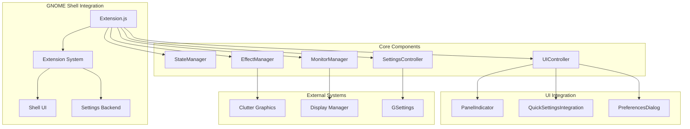
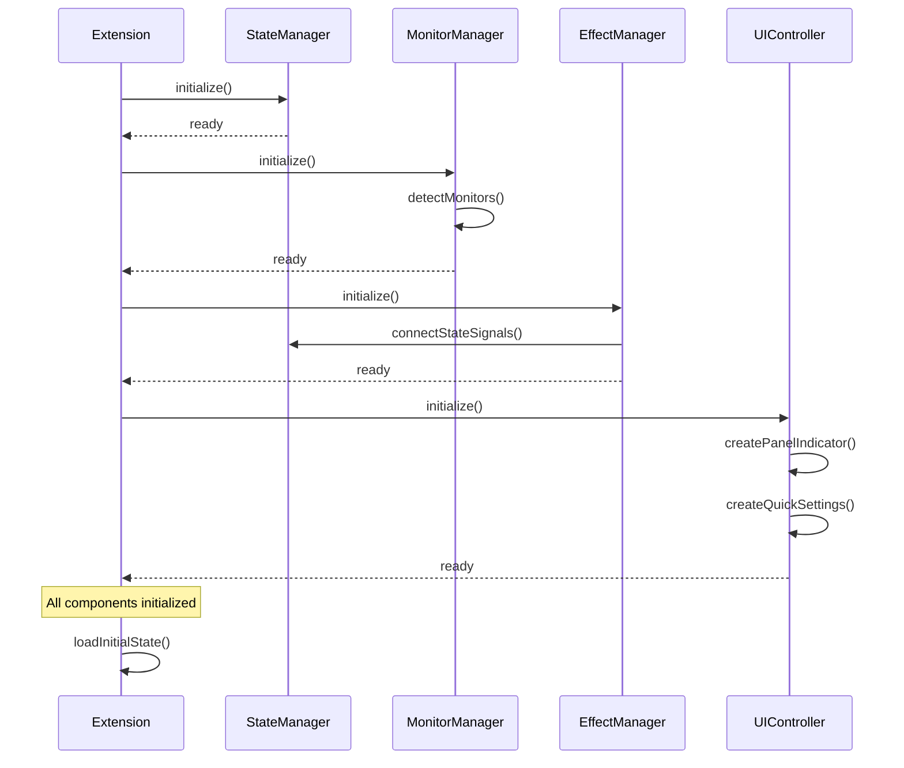

# Grayscale Toggle - Developer Guide

> **Comprehensive developer documentation** for contributing to, extending, and
> understanding the GNOME Shell Grayscale Toggle Extension.

## 📋 Table of Contents

1. [Development Environment](#-development-environment)
2. [Architecture Overview](#-architecture-overview)
3. [Component Documentation](#️-component-documentation)
4. [API Reference](#-api-reference)
5. [Development Workflow](#-development-workflow)
6. [Testing Guidelines](#-testing-guidelines)
7. [Contribution Guidelines](#-contribution-guidelines)
8. [Extension Development Patterns](#-extension-development-patterns)

---

## 🛠 Development Environment

### Prerequisites

#### Required Software

```bash
# Ubuntu/Debian
sudo apt update && sudo apt install -y \
    gnome-shell-extensions \
    gjs \
    libglib2.0-dev \
    libgtk-4-dev \
    gettext \
    nodejs \
    npm

# Fedora
sudo dnf install -y \
    gnome-shell \
    gjs \
    glib2-devel \
    gtk4-devel \
    gettext \
    nodejs \
    npm

# Arch Linux
sudo pacman -S \
    gnome-shell \
    gjs \
    glib2 \
    gtk4 \
    gettext \
    nodejs \
    npm
```

#### Development Tools

```bash
# TypeScript for type checking
npm install -g typescript

# ESLint for code quality
npm install -g eslint

# GNOME Extension development tools
npm install -g @girs/gjs
```

### Project Setup

#### Clone and Initialize

```bash
# Clone the repository
git clone https://github.com/webaheadstudios/grayscale-gnome-extension.git
cd grayscale-gnome-extension

# Set up development environment
export GNOME_SHELL_DEVELOPMENT=true
export G_MESSAGES_DEBUG=all

# Install dependencies and build
npm install
npm run build
```

#### Development Installation

```bash
# Build and install in dev mode (creates symlink, compiles schemas, enables extension)
npm run dev:install
```

#### Live Development Workflow

```bash
# Monitor extension logs in real-time
journalctl --user -f | grep -E "(GrayscaleToggle|JS ERROR|EXTENSION)"

# Wayland: GJS cannot unload ES modules — use a nested shell for each test cycle
# Terminal 1: rebuild on each change
npm run build:dev

# Terminal 2: start a fresh nested shell to load the new module code
npm run dev:nested
# After each build: close the nested shell window and run dev:nested again

# X11 only: quick restart (does NOT reload new module code on Wayland)
gnome-extensions disable grayscale-toggle@webaheadstudios.com && \
gnome-extensions enable grayscale-toggle@webaheadstudios.com
```

---

## 🏗 Architecture Overview

### High-Level Design



### Design Principles

#### Modular Architecture

- **Separation of Concerns**: Each component has a single, well-defined
  responsibility
- **Loose Coupling**: Components communicate through well-defined interfaces
- **Dependency Injection**: Components receive dependencies rather than creating
  them
- **Event-Driven**: State changes propagate through signals/events

#### Performance Considerations

- **Lazy Loading**: Components initialize only when needed
- **Resource Cleanup**: Proper disposal of resources and event handlers
- **Hardware Acceleration**: Utilize Clutter for GPU-accelerated effects
- **Async Operations**: Non-blocking initialization and state changes

#### Error Handling

- **Graceful Degradation**: Extension continues functioning with reduced
  features on errors
- **Comprehensive Logging**: Detailed debug information for troubleshooting
- **Fallback Mechanisms**: Backup strategies when primary features fail
- **Memory Safety**: Proper cleanup to prevent leaks and crashes

### Component Lifecycle



---

## ⚙️ Component Documentation

### Extension.js - Main Extension Controller

**Purpose**: Central coordinator and lifecycle manager for all extension
components.

#### Key Responsibilities

- Component initialization and destruction
- Dependency management and injection
- Error handling and logging
- Extension enable/disable lifecycle

#### Public API

```javascript
class GrayscaleExtension extends Extension {
    // Lifecycle methods
    enable()                    // Initialize extension
    disable()                   // Clean up extension

    // Component access
    getComponent(name)          // Get component instance

    // Properties
    metadata                    // Extension metadata
    _components                 // Component registry
    _initialized               // Initialization state
}
```

#### Component Dependencies

```
Extension
├── SettingsController (first)
├── MonitorManager
├── StateManager
├── EffectManager
└── UIController (last)
```

### StateManager.js - Settings and State Management

**Purpose**: Centralized state management and GSettings integration.

#### Key Responsibilities

- GSettings schema binding and validation
- State persistence across sessions
- Change notifications and event propagation
- Per-monitor state management

#### Public API

```javascript
class StateManager extends GObject.Object {
    // State access
    getGlobalState()            // Get global grayscale state
    setGlobalState(enabled)     // Set global grayscale state
    getMonitorState(monitor)    // Get per-monitor state
    setMonitorState(monitor, enabled) // Set per-monitor state

    // Settings access
    getSetting(key)             // Get setting value
    setSetting(key, value)      // Set setting value
    resetSettings()             // Reset to defaults

    // Signals emitted
    'state-changed'             // Global state change
    'monitor-state-changed'     // Per-monitor state change
    'setting-changed'           // Setting value change
}
```

#### GSettings Schema Integration

```xml
<!-- Key settings managed by StateManager -->
<key name="grayscale-enabled" type="b">
<key name="per-monitor-mode" type="b">
<key name="monitor-states" type="a{sb}">  <!-- Map: monitor_id -> enabled -->
<key name="animation-duration" type="u">
<key name="grayscale-intensity" type="d">
```

### EffectManager.js - Graphics Effect Management

**Purpose**: Hardware-accelerated grayscale effect application and management.

#### Key Responsibilities

- Clutter.DesaturateEffect lifecycle management
- Smooth animations and transitions
- Per-monitor effect application
- Performance optimization

#### Public API

```javascript
class EffectManager extends GObject.Object {
    // Effect control
    async applyGlobalEffect()      // Apply to all monitors
    async removeGlobalEffect()     // Remove from all monitors
    async applyMonitorEffect(monitor) // Apply to specific monitor
    async removeMonitorEffect(monitor) // Remove from specific monitor

    // Batch operations
    async applyEffects(monitorList) // Apply to multiple monitors
    async removeAllEffects()        // Remove from all monitors

    // Configuration
    setAnimationDuration(ms)        // Set transition duration
    setEffectQuality(level)         // Set rendering quality
    setIntensity(factor)           // Set grayscale intensity

    // Signals emitted
    'effect-applied'               // Effect applied to monitor
    'effect-removed'               // Effect removed from monitor
    'all-effects-removed'          // All effects cleared
}
```

#### Effect Application Algorithm

```javascript
// Simplified effect application flow
async applyMonitorEffect(monitorIndex) {
    const monitor = this._getMonitorActor(monitorIndex);
    const effect = new Clutter.DesaturateEffect({
        factor: this._settings.intensity
    });

    // Smooth animation
    monitor.add_effect(effect);
    effect.set_factor(0.0);

    effect.ease({
        factor: this._settings.intensity,
        duration: this._settings.animationDuration,
        mode: Clutter.AnimationMode.EASE_IN_OUT
    });
}
```

### MonitorManager.js - Multi-Monitor Support

**Purpose**: Advanced monitor detection, hotplug handling, and display
management.

#### Key Responsibilities

- Real-time monitor detection and tracking
- Display hotplug event handling
- Monitor identification and naming
- Geometry and configuration management

#### Public API

```javascript
class MonitorManager extends GObject.Object {
    // Monitor discovery
    getConnectedMonitors()         // List all connected monitors
    getPrimaryMonitor()            // Get primary display
    getMonitorInfo(index)         // Get detailed monitor info

    // Event handling
    enableHotplugDetection()       // Start monitoring for changes
    disableHotplugDetection()      // Stop monitoring

    // Monitor identification
    getMonitorName(index)          // Human-readable monitor name
    getMonitorId(index)           // Unique monitor identifier

    // Signals emitted
    'monitor-added'                // New monitor connected
    'monitor-removed'              // Monitor disconnected
    'monitor-changed'              // Monitor properties changed
    'monitors-reconfigured'        // Display layout changed
}
```

#### Monitor Detection Algorithm

```javascript
// Advanced monitor detection with hotplug support
class AdvancedMonitorDetection {
    async performScan() {
        const displays = Main.layoutManager.monitors;
        const detected = new Map();

        for (let i = 0; i < displays.length; i++) {
            const info = {
                index: i,
                geometry: displays[i],
                isPrimary: i === Main.layoutManager.primaryIndex,
                connector: this._getConnectorInfo(i),
                id: this._generateStableId(displays[i]),
            };
            detected.set(i, info);
        }

        return detected;
    }
}
```

### UIController.js - User Interface Coordination

**Purpose**: Coordinate all UI components and manage user interactions.

#### Key Responsibilities

- Panel indicator lifecycle management
- Quick Settings integration
- Preferences dialog coordination
- UI state synchronization

#### Public API

```javascript
class UIController extends GObject.Object {
    // UI lifecycle
    async initialize()             // Initialize all UI components
    destroy()                      // Clean up UI components

    // Component access
    getPanelIndicator()           // Get panel indicator instance
    getQuickSettings()            // Get Quick Settings integration

    // State synchronization
    updateUIState()               // Sync UI with current state
    showNotification(message)     // Display status notification

    // Signals emitted
    'toggle-requested'            // User requested toggle
    'preferences-opened'          // Preferences dialog opened
}
```

---

## 📖 API Reference

### Extension Signals

#### StateManager Signals

```javascript
// Global state changes
connect('state-changed', (manager, enabled) => {
    console.log(`Global grayscale: ${enabled}`);
});

// Per-monitor state changes
connect('monitor-state-changed', (manager, monitorIndex, enabled) => {
    console.log(`Monitor ${monitorIndex} grayscale: ${enabled}`);
});

// Setting changes
connect('setting-changed', (manager, key, value) => {
    console.log(`Setting ${key} changed to: ${value}`);
});
```

#### MonitorManager Signals

```javascript
// Monitor hotplug events
connect('monitor-added', (manager, monitorInfo) => {
    console.log(`Monitor added: ${monitorInfo.name}`);
    // Apply current state to new monitor
});

connect('monitor-removed', (manager, monitorIndex) => {
    console.log(`Monitor ${monitorIndex} removed`);
    // Clean up monitor-specific state
});
```

#### EffectManager Signals

```javascript
// Effect application tracking
connect('effect-applied', (manager, monitorIndex, effectName, animated) => {
    console.log(`Effect ${effectName} applied to monitor ${monitorIndex}`);
});

connect('effect-removed', (manager, monitorIndex, effectName, animated) => {
    console.log(`Effect ${effectName} removed from monitor ${monitorIndex}`);
});
```

### GSettings Schema Reference

#### Complete Schema Structure

```xml
<schema id="org.gnome.shell.extensions.grayscale-toggle"
        path="/org/gnome/shell/extensions/grayscale-toggle/">

  <!-- Core functionality -->
  <key name="grayscale-enabled" type="b">
    <default>false</default>
    <summary>Global grayscale state</summary>
  </key>

  <!-- Multi-monitor support -->
  <key name="per-monitor-mode" type="b">
    <default>false</default>
    <summary>Enable per-monitor control</summary>
  </key>

  <key name="monitor-states" type="a{sb}">
    <default>{}</default>
    <summary>Per-monitor grayscale states</summary>
  </key>

  <!-- UI preferences -->
  <key name="show-panel-indicator" type="b">
    <default>true</default>
    <summary>Show panel indicator</summary>
  </key>

  <!-- Effect settings -->
  <key name="grayscale-intensity" type="d">
    <default>1.0</default>
    <range min="0.0" max="1.0"/>
    <summary>Grayscale effect intensity</summary>
  </key>

  <!-- Performance options -->
  <key name="performance-mode" type="b">
    <default>false</default>
    <summary>Enable performance optimizations</summary>
  </key>
</schema>
```

---

## 🔄 Development Workflow

### Code Style Guidelines

#### JavaScript/GJS Standards

```javascript
// Use modern ES6+ features
import { Extension } from 'resource:///org/gnome/shell/extensions/extension.js';
import GObject from 'gi://GObject';

// ✅ Class definitions with proper GObject registration (REQUIRED for signals)
// Never use static [GObject.signals] — it does not register the GType and crashes
export const MyComponent = GObject.registerClass(
    {
        GTypeName: 'GrayscaleMyComponent',
        Signals: {
            'custom-signal': {
                param_types: [GObject.TYPE_STRING],
            },
        },
    },
    class MyComponent extends GObject.Object {
        _init(extension) {
            super._init();
            this._extension = extension;
            this._initialized = false;
        }

        // Proper resource cleanup
        destroy() {
            if (!this._initialized) return;

            this._disconnectSignals();
            this._cleanupResources();
            this._initialized = false;
        }
    }
);
```

#### Naming Conventions

- **Classes**: PascalCase (`StateManager`, `EffectManager`)
- **Methods**: camelCase (`initialize()`, `getMonitorState()`)
- **Properties**: camelCase with underscore prefix for private (`_settings`,
  `_monitors`)
- **Constants**: SCREAMING_SNAKE_CASE (`DEFAULT_ANIMATION_DURATION`)
- **Signals**: kebab-case (`'state-changed'`, `'monitor-added'`)

#### Documentation Standards

```javascript
/**
 * Apply grayscale effect to specific monitor with animation
 *
 * @param {number} monitorIndex - Zero-based monitor index
 * @param {Object} options - Effect options
 * @param {number} options.intensity - Grayscale intensity (0.0-1.0)
 * @param {number} options.duration - Animation duration in ms
 * @param {boolean} options.animated - Whether to animate transition
 * @returns {Promise<boolean>} Promise resolving to success state
 * @throws {Error} If monitor index is invalid
 *
 * @example
 * // Apply full grayscale to primary monitor
 * await effectManager.applyMonitorEffect(0, {
 *     intensity: 1.0,
 *     duration: 300,
 *     animated: true
 * });
 */
async applyMonitorEffect(monitorIndex, options = {}) {
    // Implementation...
}
```

### Git Workflow

#### Branch Strategy

```bash
# Main development branch
main                    # Stable releases only

# Feature development
feature/multi-monitor-improvements
feature/performance-optimizations
feature/accessibility-enhancements

# Bug fixes
fix/animation-glitch-on-nvidia
fix/memory-leak-on-disable
fix/hotplug-race-condition

# Releases
release/v1.1.0
release/v1.2.0
```

#### Commit Message Format

Following [Conventional Commits](https://www.conventionalcommits.org/):

```bash
# Feature additions
feat(monitor): add support for display rotation detection
feat(ui): implement Quick Settings integration for GNOME 46
feat(effects): add configurable grayscale intensity

# Bug fixes
fix(hotplug): resolve race condition in monitor detection
fix(animation): correct easing curve for smooth transitions
fix(memory): prevent leak in effect cleanup

# Performance improvements
perf(effects): optimize effect application for multiple monitors
perf(ui): reduce panel indicator update frequency

# Documentation
docs(api): add comprehensive JSDoc comments
docs(guide): update installation instructions for Fedora 40

# Refactoring
refactor(state): simplify monitor state management logic
refactor(ui): extract common panel menu functionality

# Tests
test(monitor): add hotplug event simulation tests
test(effects): add performance benchmarking suite
```

### Quality Assurance

#### Pre-commit Checks

```bash
#!/bin/bash
# .git/hooks/pre-commit

# Type checking
echo "Running TypeScript type check..."
npx tsc --noEmit || exit 1

# Linting
echo "Running ESLint..."
eslint src/**/*.js || exit 1

# Schema validation
echo "Validating GSettings schema..."
glib-compile-schemas --strict schemas/ || exit 1

# Extension metadata validation
echo "Validating extension metadata..."
gnome-extensions show grayscale-toggle@webaheadstudios.com >/dev/null 2>&1 || exit 1

echo "All checks passed!"
```

#### Continuous Integration

```yaml
# .github/workflows/ci.yml
name: Continuous Integration
on: [push, pull_request]

jobs:
    test:
        runs-on: ubuntu-latest
        steps:
            - uses: actions/checkout@v3

            - name: Install dependencies
              run: |
                  sudo apt update
                  sudo apt install -y gjs libglib2.0-dev

            - name: Type checking
              run: npx tsc --noEmit

            - name: Linting
              run: eslint src/**/*.js

            - name: Schema validation
              run: glib-compile-schemas --strict schemas/

            - name: Extension validation
              run: |
                  mkdir -p ~/.local/share/gnome-shell/extensions
                  cp -r src ~/.local/share/gnome-shell/extensions/grayscale-toggle@webaheadstudios.com
                  # Additional validation steps...
```

---

## 🧪 Testing Guidelines

### Unit Testing Framework

#### Test Structure

```javascript
// tests/unit/stateManager.test.js
import { StateManager } from '../../src/stateManager.js';
import { MockExtension } from '../mocks/extension.js';

describe('StateManager', () => {
    let stateManager;
    let mockExtension;

    beforeEach(() => {
        mockExtension = new MockExtension();
        stateManager = new StateManager(mockExtension);
    });

    afterEach(() => {
        stateManager.destroy();
    });

    describe('Global State Management', () => {
        test('should initialize with disabled state', () => {
            expect(stateManager.getGlobalState()).toBe(false);
        });

        test('should emit signal when global state changes', async () => {
            const signalSpy = jest.fn();
            stateManager.connect('state-changed', signalSpy);

            await stateManager.setGlobalState(true);

            expect(signalSpy).toHaveBeenCalledWith(stateManager, true);
            expect(stateManager.getGlobalState()).toBe(true);
        });
    });

    describe('Per-Monitor State Management', () => {
        test('should manage monitor states independently', async () => {
            await stateManager.enablePerMonitorMode();

            await stateManager.setMonitorState(0, true);
            await stateManager.setMonitorState(1, false);

            expect(stateManager.getMonitorState(0)).toBe(true);
            expect(stateManager.getMonitorState(1)).toBe(false);
        });
    });
});
```

#### Mock Objects

```javascript
// tests/mocks/extension.js
export class MockExtension {
    constructor() {
        this.metadata = {
            name: 'Test Grayscale Extension',
            version: '1.0.0',
        };
        this._components = new Map();
    }

    getComponent(name) {
        return this._components.get(name);
    }

    setComponent(name, component) {
        this._components.set(name, component);
    }
}

// tests/mocks/gnome.js
export const MockMain = {
    layoutManager: {
        monitors: [
            { x: 0, y: 0, width: 1920, height: 1080 },
            { x: 1920, y: 0, width: 1920, height: 1080 },
        ],
        primaryIndex: 0,
    },
};
```

### Integration Testing

#### Multi-Monitor Test Suite

```javascript
// tests/integration/multiMonitor.test.js
describe('Multi-Monitor Integration', () => {
    let extension;

    beforeAll(async () => {
        // Set up test environment with multiple monitors
        await setupTestEnvironment({
            monitors: [
                { width: 1920, height: 1080, primary: true },
                { width: 1680, height: 1050, primary: false },
            ],
        });
        extension = new GrayscaleExtension(mockMetadata);
        await extension.enable();
    });

    test('should detect all monitors correctly', () => {
        const monitorManager = extension.getComponent('MonitorManager');
        const monitors = monitorManager.getConnectedMonitors();

        expect(monitors.length).toBe(2);
        expect(monitors[0].isPrimary).toBe(true);
    });

    test('should handle monitor hotplug events', async () => {
        const monitorManager = extension.getComponent('MonitorManager');
        const effectManager = extension.getComponent('EffectManager');

        // Simulate monitor connection
        await simulateMonitorConnection({
            width: 2560,
            height: 1440,
        });

        // Wait for detection
        await waitForCondition(
            () => monitorManager.getConnectedMonitors().length === 3
        );

        // Verify new monitor is handled correctly
        const monitors = monitorManager.getConnectedMonitors();
        expect(monitors.length).toBe(3);
    });
});
```

### Performance Testing

#### Animation Performance

```javascript
// tests/performance/animations.test.js
describe('Animation Performance', () => {
    test('should complete transitions within time budget', async () => {
        const effectManager = extension.getComponent('EffectManager');
        const startTime = performance.now();

        await effectManager.applyGlobalEffect({
            duration: 300,
            animated: true,
        });

        const endTime = performance.now();
        const actualDuration = endTime - startTime;

        // Allow 10% tolerance for timing
        expect(actualDuration).toBeLessThan(330);
        expect(actualDuration).toBeGreaterThan(270);
    });

    test('should maintain frame rate during transitions', async () => {
        const frameRateMonitor = new FrameRateMonitor();
        frameRateMonitor.start();

        await effectManager.applyGlobalEffect({ duration: 1000 });

        const averageFrameRate = frameRateMonitor.getAverageFrameRate();
        expect(averageFrameRate).toBeGreaterThan(30); // Minimum acceptable FPS
    });
});
```

---

## 🤝 Contribution Guidelines

### Getting Started

#### First-Time Contributors

1. **Read the Documentation**: Familiarize yourself with this guide and the user
   documentation
2. **Set Up Development Environment**: Follow the setup instructions above
3. **Find an Issue**: Look for issues labeled "good first issue" or "help
   wanted"
4. **Ask Questions**: Don't hesitate to ask for clarification in issues or
   discussions

#### Issue Reporting

```markdown
**Bug Report Template**

**Describe the bug** A clear description of what the bug is.

**To Reproduce** Steps to reproduce the behavior:

1. Go to '...'
2. Click on '...'
3. Scroll down to '...'
4. See error

**Expected behavior** A clear description of what you expected to happen.

**Environment:**

- OS: [e.g. Ubuntu 24.04]
- GNOME Shell version: [e.g. 46.0]
- Extension version: [e.g. 1.0.0]
- Graphics: [e.g. NVIDIA GTX 1060]

**Additional context** Add any other context about the problem here.
```

### Code Contribution Process

#### Development Workflow

1. **Fork the repository** on GitHub
2. **Create a feature branch**: `git checkout -b feature/my-new-feature`
3. **Implement your changes** following the code style guidelines
4. **Add tests** for new functionality
5. **Update documentation** as needed
6. **Commit with conventional format**: `git commit -m "feat: add new feature"`
7. **Push to your fork**: `git push origin feature/my-new-feature`
8. **Create a Pull Request** with detailed description

#### Pull Request Guidelines

```markdown
**Pull Request Template**

**Summary** Brief description of changes and motivation.

**Changes Made**

- [ ] Feature 1: Description
- [ ] Fix 1: Description
- [ ] Documentation updates

**Testing**

- [ ] Unit tests pass
- [ ] Integration tests pass
- [ ] Manual testing completed
- [ ] Performance impact assessed

**Checklist**

- [ ] Code follows style guidelines
- [ ] Self-review completed
- [ ] Documentation updated
- [ ] No breaking changes (or marked as such)
```

### Code Review Process

#### Review Criteria

- **Functionality**: Does the code work as intended?
- **Code Quality**: Is the code well-structured and readable?
- **Performance**: Are there any performance implications?
- **Compatibility**: Does it work across supported environments?
- **Documentation**: Is the code properly documented?
- **Testing**: Are there adequate tests?

#### Review Timeline

- **Initial Response**: Within 48 hours
- **Full Review**: Within 1 week for standard PRs
- **Complex Changes**: May require additional time and discussion

### Community Guidelines

#### Communication Standards

- **Be Respectful**: Treat all community members with respect
- **Be Constructive**: Provide helpful feedback and suggestions
- **Be Patient**: Remember that everyone is volunteering their time
- **Be Inclusive**: Welcome newcomers and diverse perspectives

#### Code of Conduct

We follow the
[GNOME Code of Conduct](https://wiki.gnome.org/Foundation/CodeOfConduct). Key
points:

- Be considerate and respectful
- Be collaborative and constructive
- When disagreeing, be thoughtful and professional
- Report issues to project maintainers

---

## 🔧 Extension Development Patterns

### GNOME Shell Extension Best Practices

#### Modern Extension Structure (GNOME 46+)

```javascript
// extension.js - Main extension file
import { Extension } from 'resource:///org/gnome/shell/extensions/extension.js';

export default class MyExtension extends Extension {
    enable() {
        // Extension initialization
    }

    disable() {
        // Cleanup when disabled
    }
}
```

#### Component Pattern Implementation

```javascript
// Base component with standardized lifecycle
export class ExtensionComponent extends GObject.Object {
    constructor(extension) {
        super();
        this._extension = extension;
        this._initialized = false;
    }

    async initialize() {
        if (this._initialized) return;

        await this._doInitialize();
        this._initialized = true;
    }

    destroy() {
        if (!this._initialized) return;

        this._doDestroy();
        this._initialized = false;
    }

    // Subclasses implement these
    async _doInitialize() {
        throw new Error('Not implemented');
    }
    _doDestroy() {
        throw new Error('Not implemented');
    }
}
```

#### Signal Management Pattern

```javascript
class SignalManager {
    constructor() {
        this._connections = [];
    }

    connect(object, signal, callback) {
        const id = object.connect(signal, callback);
        this._connections.push({ object, id });
        return id;
    }

    disconnectAll() {
        this._connections.forEach(({ object, id }) => {
            object.disconnect(id);
        });
        this._connections = [];
    }
}
```

#### Settings Management Pattern

```javascript
class SettingsManager {
    constructor(schemaId) {
        this._settings = ExtensionUtils.getSettings(schemaId);
        this._bindings = new Map();
    }

    bind(key, object, property) {
        this._settings.bind(
            key,
            object,
            property,
            Gio.SettingsBindFlags.DEFAULT
        );
        this._bindings.set(key, { object, property });
    }

    unbindAll() {
        this._bindings.forEach(({ object, property }, key) => {
            this._settings.unbind(object, property);
        });
        this._bindings.clear();
    }
}
```

### Performance Optimization Patterns

#### Lazy Loading Components

```javascript
class LazyComponentLoader {
    constructor() {
        this._components = new Map();
        this._loaders = new Map();
    }

    register(name, loader) {
        this._loaders.set(name, loader);
    }

    get(name) {
        if (!this._components.has(name)) {
            const loader = this._loaders.get(name);
```
