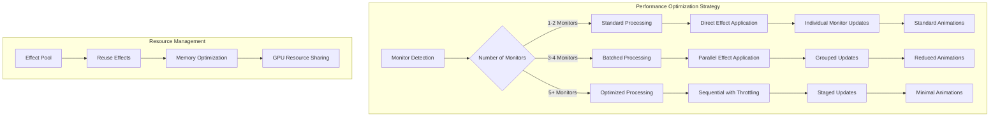

# TECHNICAL SPECIFICATION - CONTINUATION

## Continuing from Section 6.2

### 6.2 Panel Indicator Implementation (Continued)

```javascript
// Panel Indicator State Management
_updateIndicator() {
    const globalState = this._stateManager.getGrayscaleState();
    const isPerMonitor = this._stateManager.getSetting('perMonitorMode');
    
    if (isPerMonitor) {
        const monitorStates = this._stateManager.getAllMonitorStates();
        const enabledCount = Object.values(monitorStates).filter(state => state).length;
        const totalCount = Object.keys(monitorStates).length;
        
        if (enabledCount === 0) {
            this._icon.icon_name = 'display-symbolic';
            this._icon.style_class = 'system-status-icon';
        } else if (enabledCount === totalCount) {
            this._icon.icon_name = 'display-brightness-symbolic';
            this._icon.style_class = 'system-status-icon grayscale-active';
        } else {
            this._icon.icon_name = 'display-brightness-symbolic';
            this._icon.style_class = 'system-status-icon grayscale-partial';
        }
    } else {
        this._icon.icon_name = globalState ? 'display-brightness-symbolic' : 'display-symbolic';
        this._icon.style_class = globalState ? 
            'system-status-icon grayscale-active' : 'system-status-icon';
    }
}
```

### 6.3 Keyboard Shortcut Registration

```javascript
// src/utils/keyboardManager.js
export class KeyboardManager {
    constructor(extension, stateManager) {
        this._extension = extension;
        this._stateManager = stateManager;
        this._registeredShortcuts = new Map();
    }
    
    registerShortcuts() {
        const shortcuts = this._getShortcutDefinitions();
        
        shortcuts.forEach(({ name, keys, callback }) => {
            try {
                Main.wm.addKeybinding(
                    name,
                    this._extension.getSettings(),
                    Meta.KeyBindingFlags.NONE,
                    Shell.ActionMode.ALL,
                    callback
                );
                
                this._registeredShortcuts.set(name, { keys, callback });
                console.log(`[KeyboardManager] Registered shortcut: ${name} (${keys.join(', ')})`);
            } catch (error) {
                console.error(`Failed to register shortcut ${name}:`, error);
            }
        });
    }
    
    unregisterShortcuts() {
        for (const [name] of this._registeredShortcuts) {
            try {
                Main.wm.removeKeybinding(name);
            } catch (error) {
                console.error(`Failed to unregister shortcut ${name}:`, error);
            }
        }
        this._registeredShortcuts.clear();
        console.log('[KeyboardManager] All shortcuts unregistered');
    }
    
    _getShortcutDefinitions() {
        return [
            {
                name: 'toggle-grayscale-global',
                keys: this._stateManager.getSetting('toggle-shortcut') || ['<Super><Alt>g'],
                callback: () => this._handleGlobalToggle()
            },
            {
                name: 'toggle-grayscale-primary',
                keys: this._stateManager.getSetting('primary-monitor-shortcut') || [],
                callback: () => this._handlePrimaryMonitorToggle()
            }
        ];
    }
    
    _handleGlobalToggle() {
        this._stateManager.toggleGrayscaleState();
    }
    
    _handlePrimaryMonitorToggle() {
        const monitorManager = this._extension.getComponent('MonitorManager');
        const primaryMonitor = monitorManager.getPrimaryMonitor();
        
        if (primaryMonitor) {
            const currentState = this._stateManager.getMonitorState(primaryMonitor.index);
            this._stateManager.setMonitorState(primaryMonitor.index, !currentState);
        }
    }
}
```

### 6.4 Accessibility Integration

```javascript
// src/ui/accessibilityManager.js
export class AccessibilityManager {
    constructor(extension, stateManager) {
        this._extension = extension;
        this._stateManager = stateManager;
        this._announcements = new Map();
    }
    
    initialize() {
        this._stateManager.connect('state-changed', (enabled) => {
            this._announceStateChange(enabled);
        });
        
        this._stateManager.connect('monitor-state-changed', (index, enabled) => {
            this._announceMonitorStateChange(index, enabled);
        });
    }
    
    _announceStateChange(enabled) {
        if (!this._stateManager.getSetting('screen-reader-announcements')) {
            return;
        }
        
        const message = enabled ? 
            'Grayscale effect enabled on all displays' : 
            'Grayscale effect disabled on all displays';
        
        this._makeAnnouncement(message);
    }
    
    _announceMonitorStateChange(index, enabled) {
        if (!this._stateManager.getSetting('screen-reader-announcements')) {
            return;
        }
        
        const monitorManager = this._extension.getComponent('MonitorManager');
        const monitor = monitorManager.getMonitorInfo(index);
        const monitorName = monitor?.isPrimary ? 'primary monitor' : `monitor ${index + 1}`;
        
        const message = enabled ?
            `Grayscale effect enabled on ${monitorName}` :
            `Grayscale effect disabled on ${monitorName}`;
        
        this._makeAnnouncement(message);
    }
    
    _makeAnnouncement(message) {
        // Use GNOME's accessibility announcement system
        if (global.display && global.display.get_sound_player) {
            global.display.get_sound_player().play_from_theme(
                'message',
                'Grayscale Toggle',
                null
            );
        }
        
        // Screen reader announcement via AT-SPI
        if (global.context && global.context.get_accessibility_registry) {
            const registry = global.context.get_accessibility_registry();
            registry.announce(message, 'polite');
        }
    }
}
```

---

## 7. Multi-Monitor Support Details

### 7.1 Monitor Detection Algorithms

```javascript
// Advanced monitor detection with hotplug support
export class AdvancedMonitorDetection {
    constructor() {
        this._detectionMethods = [
            this._detectViaLayoutManager.bind(this),
            this._detectViaMetaDisplay.bind(this),
            this._detectViaConnectors.bind(this)
        ];
        this._lastDetectedMonitors = new Map();
    }
    
    async detectMonitors() {
        const detectionResults = [];
        
        // Try each detection method
        for (const method of this._detectionMethods) {
            try {
                const result = await method();
                if (result && result.length > 0) {
                    detectionResults.push(result);
                }
            } catch (error) {
                console.warn('Monitor detection method failed:', error);
            }
        }
        
        // Merge and validate results
        const consolidatedMonitors = this._consolidateDetectionResults(detectionResults);
        
        // Detect changes from last scan
        const changes = this._detectChanges(consolidatedMonitors);
        
        // Update cache
        this._lastDetectedMonitors = new Map(
            consolidatedMonitors.map(monitor => [monitor.index, monitor])
        );
        
        return { monitors: consolidatedMonitors, changes };
    }
    
    _detectViaLayoutManager() {
        const layoutManager = Main.layoutManager;
        const monitors = [];
        
        for (let i = 0; i < layoutManager.monitors.length; i++) {
            const monitor = layoutManager.monitors[i];
            
            monitors.push({
                index: i,
                geometry: {
                    x: monitor.x,
                    y: monitor.y,
                    width: monitor.width,
                    height: monitor.height
                },
                isPrimary: i === layoutManager.primaryIndex,
                scaleFactor: monitor.geometry_scale || 1.0,
                connector: this._getConnectorName(i),
                actor: this._getMonitorActor(i),
                detectionMethod: 'layout-manager',
                confidence: 0.95
            });
        }
        
        return monitors;
    }
    
    _detectViaMetaDisplay() {
        const display = global.display;
        const monitors = [];
        
        for (let i = 0; i < display.get_n_monitors(); i++) {
            const geometry = display.get_monitor_geometry(i);
            const scale = display.get_monitor_scale(i);
            
            monitors.push({
                index: i,
                geometry: {
                    x: geometry.x,
                    y: geometry.y,
                    width: geometry.width,
                    height: geometry.height
                },
                isPrimary: i === display.get_primary_monitor(),
                scaleFactor: scale,
                connector: `META-${i}`,
                detectionMethod: 'meta-display',
                confidence: 0.90
            });
        }
        
        return monitors;
    }
    
    _detectViaConnectors() {
        // Attempt to detect via xrandr or similar system calls
        // This is a fallback method for additional validation
        return [];
    }
    
    _consolidateDetectionResults(results) {
        if (results.length === 0) return [];
        
        // Use the highest confidence result set
        const bestResult = results.reduce((best, current) => {
            const bestConfidence = this._calculateAverageConfidence(best);
            const currentConfidence = this._calculateAverageConfidence(current);
            return currentConfidence > bestConfidence ? current : best;
        });
        
        return bestResult.map(monitor => ({
            ...monitor,
            lastSeen: Date.now(),
            active: true
        }));
    }
    
    _calculateAverageConfidence(monitors) {
        if (!monitors || monitors.length === 0) return 0;
        const totalConfidence = monitors.reduce((sum, monitor) => 
            sum + (monitor.confidence || 0.5), 0);
        return totalConfidence / monitors.length;
    }
    
    _detectChanges(newMonitors) {
        const changes = {
            added: [],
            removed: [],
            modified: []
        };
        
        // Detect added monitors
        newMonitors.forEach(monitor => {
            if (!this._lastDetectedMonitors.has(monitor.index)) {
                changes.added.push(monitor);
            } else {
                // Check for modifications
                const lastMonitor = this._lastDetectedMonitors.get(monitor.index);
                if (this._hasMonitorChanged(lastMonitor, monitor)) {
                    changes.modified.push({ previous: lastMonitor, current: monitor });
                }
            }
        });
        
        // Detect removed monitors
        this._lastDetectedMonitors.forEach((monitor, index) => {
            if (!newMonitors.find(m => m.index === index)) {
                changes.removed.push(monitor);
            }
        });
        
        return changes;
    }
    
    _hasMonitorChanged(previous, current) {
        return (
            previous.geometry.x !== current.geometry.x ||
            previous.geometry.y !== current.geometry.y ||
            previous.geometry.width !== current.geometry.width ||
            previous.geometry.height !== current.geometry.height ||
            previous.scaleFactor !== current.scaleFactor ||
            previous.isPrimary !== current.isPrimary
        );
    }
    
    _getConnectorName(index) {
        // Attempt to get real connector name
        try {
            const monitorManager = Meta.MonitorManager.get();
            const monitors = monitorManager.get_monitors();
            return monitors[index]?.get_connector() || `Monitor-${index}`;
        } catch {
            return `Monitor-${index}`;
        }
    }
    
    _getMonitorActor(index) {
        const layoutManager = Main.layoutManager;
        return layoutManager.monitors[index] || null;
    }
}
```

### 7.2 Hotplug Event Handling

```javascript
// Comprehensive hotplug event management
export class HotplugEventManager {
    constructor(monitorManager, effectManager) {
        this._monitorManager = monitorManager;
        this._effectManager = effectManager;
        this._pendingOperations = new Map();
        this._debounceTimer = null;
        this._eventQueue = [];
    }
    
    initialize() {
        // Connect to layout manager signals
        this._layoutChangeSignal = Main.layoutManager.connect(
            'monitors-changed',
            () => this._handleMonitorsChanged()
        );
        
        // Connect to display configuration changes
        if (global.display) {
            this._displayConfigSignal = global.display.connect(
                'monitors-changed',
                () => this._handleDisplayConfigChanged()
            );
        }
        
        console.log('[HotplugEventManager] Initialized');
    }
    
    destroy() {
        if (this._layoutChangeSignal) {
            Main.layoutManager.disconnect(this._layoutChangeSignal);
        }
        
        if (this._displayConfigSignal && global.display) {
            global.display.disconnect(this._displayConfigSignal);
        }
        
        if (this._debounceTimer) {
            clearTimeout(this._debounceTimer);
        }
        
        this._pendingOperations.clear();
        console.log('[HotplugEventManager] Destroyed');
    }
    
    _handleMonitorsChanged() {
        console.log('[HotplugEventManager] Layout monitors changed');
        this._queueEvent('layout-changed', { source: 'layout-manager', timestamp: Date.now() });
        this._debounceProcessing();
    }
    
    _handleDisplayConfigChanged() {
        console.log('[HotplugEventManager] Display configuration changed');
        this._queueEvent('display-config-changed', { source: 'meta-display', timestamp: Date.now() });
        this._debounceProcessing();
    }
    
    _queueEvent(type, data) {
        this._eventQueue.push({ type, data, timestamp: Date.now() });
        
        // Limit queue size
        if (this._eventQueue.length > 10) {
            this._eventQueue = this._eventQueue.slice(-10);
        }
    }
    
    _debounceProcessing() {
        if (this._debounceTimer) {
            clearTimeout(this._debounceTimer);
        }
        
        this._debounceTimer = setTimeout(() => {
            this._processHotplugEvents();
            this._debounceTimer = null;
        }, 500); // 500ms debounce
    }
    
    async _processHotplugEvents() {
        if (this._eventQueue.length === 0) return;
        
        console.log(`[HotplugEventManager] Processing ${this._eventQueue.length} events`);
        
        try {
            // Suspend effects during reconfiguration
            await this._effectManager.suspendEffects();
            
            // Rescan monitors
            const { monitors, changes } = await this._monitorManager.rescanMonitors();
            
            // Process changes
            await this._processMonitorChanges(changes);
            
            // Resume effects
            await this._effectManager.resumeEffects();
            
            // Clear processed events
            this._eventQueue = [];
            
            console.log('[HotplugEventManager] Hotplug processing completed');
            
        } catch (error) {
            console.error('[HotplugEventManager] Error processing hotplug events:', error);
            
            // Recovery: try to restore minimal functionality
            await this._attemptRecovery();
        }
    }
    
    async _processMonitorChanges(changes) {
        const { added, removed, modified } = changes;
        
        // Handle removed monitors first
        for (const removedMonitor of removed) {
            await this._handleMonitorRemoved(removedMonitor);
        }
        
        // Handle modified monitors
        for (const { previous, current } of modified) {
            await this._handleMonitorModified(previous, current);
        }
        
        // Handle added monitors
        for (const addedMonitor of added) {
            await this._handleMonitorAdded(addedMonitor);
        }
    }
    
    async _handleMonitorRemoved(monitor) {
        console.log(`[HotplugEventManager] Monitor ${monitor.index} removed`);
        
        // Clean up any effects for this monitor
        const operation = this._pendingOperations.get(`remove-${monitor.index}`);
        if (operation) {
            clearTimeout(operation.timeout);
        }
        
        // Remove effects immediately
        await this._effectManager.removeMonitorEffect(monitor.index);
        
        // Emit removal signal
        this._monitorManager.emit('monitor-removed', monitor.index);
    }
    
    async _handleMonitorAdded(monitor) {
        console.log(`[HotplugEventManager] Monitor ${monitor.index} added`);
        
        // Initialize monitor state
        const stateManager = this._monitorManager._extension.getComponent('StateManager');
        const globalState = stateManager.getGrayscaleState();
        
        // Apply current global state to new monitor
        if (globalState) {
            await this._effectManager.applyMonitorEffect(monitor.index, true);
            stateManager.setMonitorState(monitor.index, true, { skipEvents: true });
        }
        
        // Emit addition signal
        this._monitorManager.emit('monitor-added', monitor);
    }
    
    async _handleMonitorModified(previousMonitor, currentMonitor) {
        console.log(`[HotplugEventManager] Monitor ${currentMonitor.index} modified`);
        
        // Check if significant changes require effect reapplication
        const significantChange = (
            previousMonitor.geometry.width !== currentMonitor.geometry.width ||
            previousMonitor.geometry.height !== currentMonitor.geometry.height ||
            previousMonitor.scaleFactor !== currentMonitor.scaleFactor
        );
        
        if (significantChange) {
            const stateManager = this._monitorManager._extension.getComponent('StateManager');
            const currentState = stateManager.getMonitorState(currentMonitor.index);
            
            if (currentState) {
                // Reapply effect with new geometry
                await this._effectManager.applyMonitorEffect(currentMonitor.index, false);
                await this._effectManager.applyMonitorEffect(currentMonitor.index, true);
            }
        }
        
        // Emit change signal
        this._monitorManager.emit('monitor-changed', currentMonitor.index, {
            previous: previousMonitor,
            current: currentMonitor
        });
    }
    
    async _attemptRecovery() {
        console.log('[HotplugEventManager] Attempting recovery from hotplug error');
        
        try {
            // Clear all effects
            await this._effectManager.removeAllEffects();
            
            // Reset to global mode
            const stateManager = this._monitorManager._extension.getComponent('StateManager');
            await stateManager.updateSetting('perMonitorMode', false);
            
            // Reapply based on global state
            const globalState = stateManager.getGrayscaleState();
            if (globalState) {
                await this._effectManager.applyGlobalEffect(true);
            }
            
            console.log('[HotplugEventManager] Recovery completed');
            
        } catch (recoveryError) {
            console.error('[HotplugEventManager] Recovery failed:', recoveryError);
        }
    }
}
```

### 7.3 Performance Optimization for Multiple Displays



---

## 8. Testing and Quality Assurance

### 8.1 Unit Testing Framework

```javascript
// tests/unit/testFramework.js
export class ExtensionTestFramework {
    constructor() {
        this.tests = new Map();
        this.mocks = new Map();
        this.results = [];
    }
    
    // Test registration
    describe(suiteName, tests) {
        this.tests.set(suiteName, tests);
    }
    
    // Individual test case
    it(testName, testFunction) {
        return { name: testName, test: testFunction };
    }
    
    // Mock setup
    mock(objectName, mockImplementation) {
        this.mocks.set(objectName, mockImplementation);
    }
    
    // Assertions
    expect(actual) {
        return {
            toBe: (expected) => {
                if (actual !== expected) {
                    throw new Error(`Expected ${expected}, got ${actual}`);
                }
            },
            toEqual: (expected) => {
                if (JSON.stringify(actual) !== JSON.stringify(expected)) {
                    throw new Error(`Expected ${JSON.stringify(expected)}, got ${JSON.stringify(actual)}`);
                }
            },
            toBeTruthy: () => {
                if (!actual) {
                    throw new Error(`Expected truthy value, got ${actual}`);
                }
            },
            toBeFalsy: () => {
                if (actual) {
                    throw new Error(`Expected falsy value, got ${actual}`);
                }
            },
            toThrow: () => {
                let threw = false;
                try {
                    if (typeof actual === 'function') {
                        actual();
                    }
                } catch (error) {
                    threw = true;
                }
                if (!threw) {
                    throw new Error('Expected function to throw');
                }
            }
        };
    }
    
    // Test runner
    async runTests() {
        console.log('Starting extension test suite...');
        
        for (const [suiteName, tests] of this.tests) {
            console.log(`\nRunning test suite: ${suiteName}`);
            
            const suiteResults = {
                name: suiteName,
                tests: [],
                passed: 0,
                failed: 0
            };
            
            for (const testCase of tests) {
                const result = await this._runSingleTest(testCase);
                suiteResults.tests.push(result);
                
                if (result.passed) {
                    suiteResults.passed++;
                    console.log(`  ✓ ${result.name}`);
                } else {
                    suiteResults.failed++;
                    console.error(`  ✗ ${result.name}: ${result.error}`);
                }
            }
            
            this.results.push(suiteResults);
        }
        
        this._printSummary();
        return this.results;
    }
    
    async _runSingleTest(testCase) {
        const startTime = Date.now();
        
        try {
            await testCase.test();
            return {
                name: testCase.name,
                passed: true,
                duration: Date.now() - startTime
            };
        } catch (error) {
            return {
                name: testCase.name,
                passed: false,
                error: error.message,
                duration: Date.now() - startTime
            };
        }
    }
    
    _printSummary() {
        const totalTests = this.results.reduce((sum, suite) => sum + suite.tests.length, 0);
        const totalPassed = this.results.reduce((sum, suite) => sum + suite.passed, 0);
        const totalFailed = this.results.reduce((sum, suite) => sum + suite.failed, 0);
        
        console.log('\n' + '='.repeat(50));
        console.log('TEST SUMMARY');
        console.log('='.repeat(50));
        console.log(`Total Tests: ${totalTests}`);
        console.log(`Passed: ${totalPassed}`);
        console.log(`Failed: ${totalFailed}`);
        console.log(`Success Rate: ${((totalPassed / totalTests) * 100).toFixed(1)}%`);
    }
}
```

### 8.2 Component Test Specifications

```javascript
// tests/unit/stateManager.test.js
import { ExtensionTestFramework } from './testFramework.js';
import { StateManager } from '../../src/components/stateManager.js';

const framework = new ExtensionTestFramework();

framework.describe('StateManager', [
    framework.it('should initialize with default state', async () => {
        const mockExtension = { getComponent: () => ({ getSetting: () => null }) };
        const stateManager = new StateManager(mockExtension);
        
        framework.expect(stateManager.getGrayscaleState()).toBe(false);
    }),
    
    framework.it('should toggle grayscale state', async () => {
        const mockExtension = { getComponent: () => ({ getSetting: () => null }) };
        const stateManager = new StateManager(mockExtension);
        
        const newState = await stateManager.toggleGrayscaleState();
        framework.expect(newState).toBe(true);
        framework.expect(stateManager.getGrayscaleState()).toBe(true);
    }),
    
    framework.it('should handle monitor state changes', async () => {
        const mockExtension = { getComponent: () => ({ getSetting: () => null }) };
        const stateManager = new StateManager(mockExtension);
        
        await stateManager.setMonitorState(0, true);
        framework.expect(stateManager.getMonitorState(0)).toBe(true);
    }),
    
    framework.it('should emit state change signals', async () => {
        const mockExtension = { getComponent: () => ({ getSetting: () => null }) };
        const stateManager = new StateManager(mockExtension);
        
        let signalEmitted = false;
        stateManager.connect('state-changed', () => {
            signalEmitted = true;
        });
        
        await stateManager.setGrayscaleState(true);
        framework.expect(signalEmitted).toBeTruthy();
    })
]);
```

### 8.3 Integration Testing Strategy

```javascript
// tests/integration/multiMonitor.test.js
export class MultiMonitorIntegrationTests {
    constructor() {
        this.testEnvironment = new MockGNOMEEnvironment();
    }
    
    async setupTestEnvironment() {
        // Create mock multi-monitor setup
        this.testEnvironment.addMonitor({
            index: 0,
            geometry: { x: 0, y: 0, width: 1920, height: 1080 },
            isPrimary: true,
            connector: 'DP-1'
        });
        
        this.testEnvironment.addMonitor({
            index: 1,
            geometry: { x: 1920, y: 0, width: 1920, height: 1080 },
            isPrimary: false,
            connector: 'DP-2'
        });
    }
    
    async testMonitorDetection() {
        const extension = new MockExtension();
        await extension.enable();
        
        const monitorManager = extension.getComponent('MonitorManager');
        const monitors = monitorManager.getActiveMonitors();
        
        console.assert(monitors.length === 2, 'Should detect 2 monitors');
        console.assert(monitors[0].isPrimary, 'First monitor should be primary');
        console.assert(!monitors[1].isPrimary, 'Second monitor should not be primary');
    }
    
    async testPerMonitorEffectApplication() {
        const extension = new MockExtension();
        await extension.enable();
        
        const stateManager = extension.getComponent('StateManager');
        const effectManager = extension.getComponent('EffectManager');
        
        // Enable per-monitor mode
        await stateManager.updateSetting('perMonitorMode', true);
        
        // Enable effect on first monitor only
        await stateManager.setMonitorState(0, true);
        
        // Verify effect is applied correctly
        console.assert(effectManager.isEffectActive(0), 'Effect should be active on monitor 0');
        console.assert(!effectManager.isEffectActive(1), 'Effect should not be active on monitor 1');
    }
    
    async testHotplugEvents() {
        const extension = new MockExtension();
        await extension.enable();
        
        const monitorManager = extension.getComponent('MonitorManager');
        
        // Add a third monitor
        this.testEnvironment.addMonitor({
            index: 2,
            geometry: { x: 3840, y: 0, width: 1920, height: 1080 },
            isPrimary: false,
            connector: 'DP-3'
        });
        
        // Trigger monitors-changed signal
        this.testEnvironment.emitMonitorsChanged();
        
        // Wait for processing
        await new Promise(resolve => setTimeout(resolve, 600));
        
        const monitors = monitorManager.getActiveMonitors();
        console.assert(monitors.length === 3, 'Should detect 3 monitors after hotplug');
    }
}
```

### 8.4 Performance Testing Specifications

```javascript
// tests/performance/effectPerformance.test.js
export class PerformanceTests {
    constructor() {
        this.metrics = {
            effectApplicationTime: [],
            memoryUsage: [],
            cpuUsage: []
        };
    }
    
    async measureEffectApplicationPerformance() {
        console.log('Running effect application performance tests...');
        
        const testCases = [
            { monitors: 1, iterations: 100 },
            { monitors: 2, iterations: 50 },
            { monitors: 4, iterations: 25 },
            { monitors: 6, iterations: 10 }
        ];
        
        for (const testCase of testCases) {
            await this._runEffectPerformanceTest(testCase);
        }
        
        this._analyzePerformanceResults();
    }
    
    async _runEffectPerformanceTest({ monitors, iterations }) {
        const extension = new MockExtension();
        const testEnv = new MockGNOMEEnvironment();
        
        // Set up test environment with specified number of monitors
        for (let i = 0