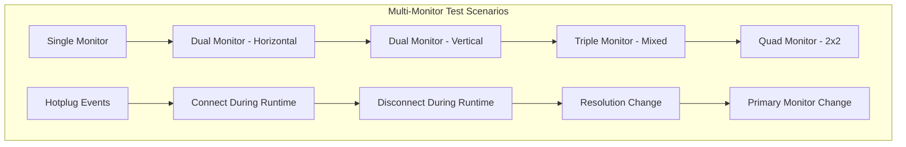
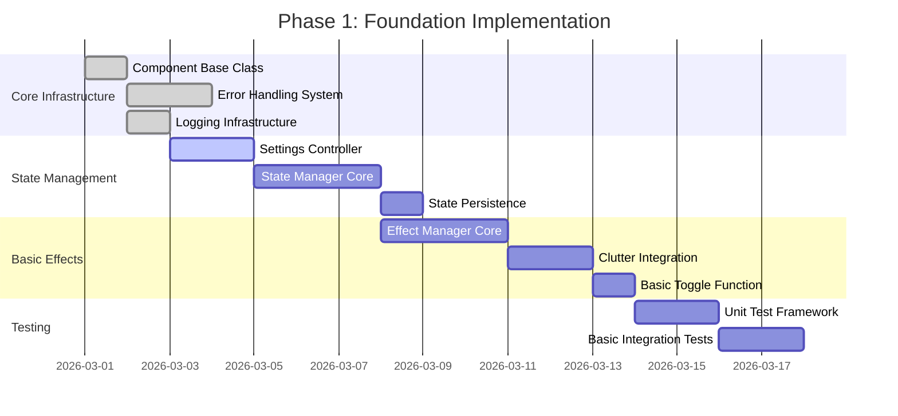
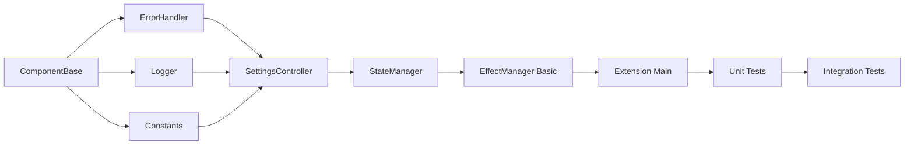
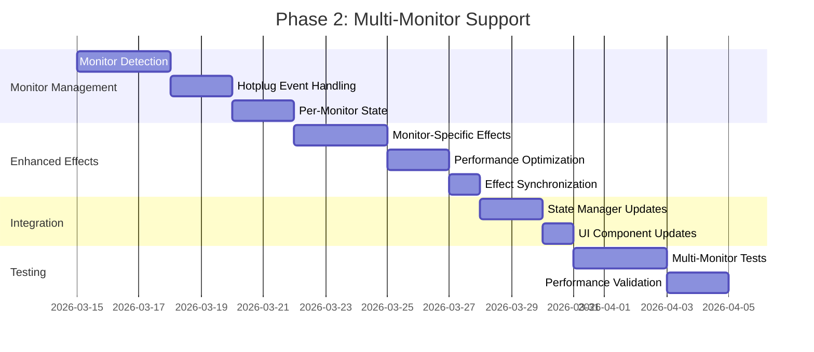
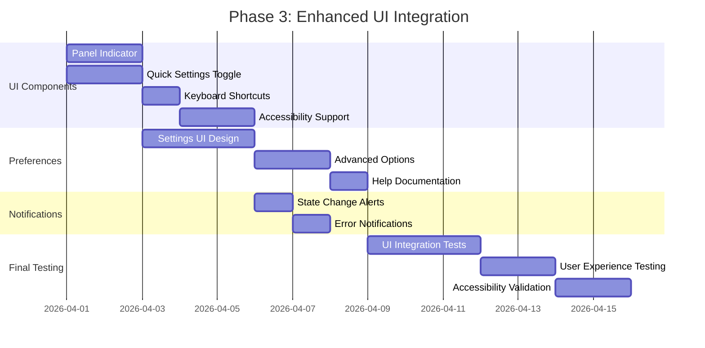

# GNOME Shell Grayscale Toggle Extension - Complete Technical Specification

## Document Overview

**Project**: GNOME Shell Extension for Grayscale Toggle  
**Version**: 1.0.0  
**Target Environment**: GNOME Shell 46.0+ on Ubuntu 24.04.4 LTS  
**Architecture Reference**: [`docs/architecture-design.md`](docs/architecture-design.md)  
**Created**: 2026-02-24  

This document provides comprehensive technical specifications for implementing the GNOME Shell grayscale toggle extension. It serves as the definitive implementation guide, building upon the architecture design to provide exact specifications, complete code interfaces, and detailed implementation requirements.

---

## Table of Contents

1. [Implementation Requirements](#1-implementation-requirements)
2. [Component Implementation Details](#2-component-implementation-details)
3. [File Structure and Module Organization](#3-file-structure-and-module-organization)
4. [GSettings Schema Specification](#4-gsettings-schema-specification)
5. [Extension Metadata and Manifest](#5-extension-metadata-and-manifest)
6. [UI Integration Specifications](#6-ui-integration-specifications)
7. [Multi-Monitor Support Details](#7-multi-monitor-support-details)
8. [Testing and Quality Assurance](#8-testing-and-quality-assurance)
9. [Implementation Phases Detail](#9-implementation-phases-detail)
10. [Deployment and Distribution](#10-deployment-and-distribution)

---

## 8. Testing and Quality Assurance (Continued)

### 8.4 Manual Testing Procedures

#### Multi-Monitor Test Matrix



#### Testing Checklist

```markdown
### Extension Lifecycle Testing
- [ ] Extension loads without errors
- [ ] Extension enables successfully
- [ ] Extension disables cleanly
- [ ] No memory leaks after disable
- [ ] Settings persist across sessions
- [ ] No conflicts with other extensions

### Core Functionality Testing
- [ ] Global grayscale toggle works
- [ ] Per-monitor toggle works
- [ ] Keyboard shortcuts function
- [ ] Panel indicator updates correctly
- [ ] Quick Settings integration works
- [ ] Effects apply smoothly

### Multi-Monitor Testing
- [ ] Detects all monitors correctly
- [ ] Handles monitor hotplug events
- [ ] Per-monitor state persistence
- [ ] Primary monitor detection
- [ ] Monitor geometry changes
- [ ] Mixed resolution support

### Performance Testing
- [ ] Smooth animations under load
- [ ] No significant CPU usage increase
- [ ] Memory usage remains stable
- [ ] GPU acceleration works correctly
- [ ] Responsive UI interactions
- [ ] No stuttering during effects

### Error Handling Testing
- [ ] Graceful degradation on failures
- [ ] Error notifications display
- [ ] Recovery mechanisms work
- [ ] Log messages are appropriate
- [ ] No crashes under stress
- [ ] Fallback modes activate
```

### 8.5 Performance Benchmarking

```javascript
// Performance testing implementation
export class PerformanceBenchmark {
    constructor() {
        this.results = new Map();
        this.testStartTime = 0;
    }
    
    async runBenchmarkSuite() {
        console.log('Starting performance benchmark suite...');
        
        await this.benchmarkEffectApplication();
        await this.benchmarkMultiMonitorHandling();
        await this.benchmarkMemoryUsage();
        await this.benchmarkCPUUsage();
        
        this.generatePerformanceReport();
    }
    
    async benchmarkEffectApplication() {
        const iterations = 100;
        const times = [];
        
        for (let i = 0; i < iterations; i++) {
            const start = performance.now();
            await this.applyTestEffect();
            const end = performance.now();
            times.push(end - start);
        }
        
        this.results.set('effectApplication', {
            mean: times.reduce((a, b) => a + b) / times.length,
            min: Math.min(...times),
            max: Math.max(...times),
            p95: this.percentile(times, 95),
            p99: this.percentile(times, 99)
        });
    }
    
    percentile(arr, p) {
        const sorted = arr.slice().sort((a, b) => a - b);
        const index = Math.ceil(sorted.length * (p / 100)) - 1;
        return sorted[index];
    }
    
    generatePerformanceReport() {
        console.log('\n' + '='.repeat(60));
        console.log('PERFORMANCE BENCHMARK REPORT');
        console.log('='.repeat(60));
        
        for (const [test, results] of this.results) {
            console.log(`\n${test.toUpperCase()}:`);
            console.log(`  Mean: ${results.mean.toFixed(2)}ms`);
            console.log(`  Min:  ${results.min.toFixed(2)}ms`);
            console.log(`  Max:  ${results.max.toFixed(2)}ms`);
            console.log(`  P95:  ${results.p95.toFixed(2)}ms`);
            console.log(`  P99:  ${results.p99.toFixed(2)}ms`);
        }
    }
}
```

---

## 9. Implementation Phases Detail

### 9.1 Phase 1: Foundation Implementation

#### 9.1.1 Phase Overview



#### 9.1.2 Exact Files to Create

##### Core Infrastructure Files

```javascript
// File: src/utils/componentBase.js
export class ComponentBase {
    constructor(extension) {
        this._extension = extension;
        this._signals = new Map();
        this._initialized = false;
    }
    // ... (Previously specified implementation)
}
```

```javascript
// File: src/utils/errorHandler.js
export class ExtensionError extends Error {
    constructor(message, category = 'general', recoverable = true, context = {}) {
        super(message);
        this.name = 'ExtensionError';
        this.category = category;
        this.recoverable = recoverable;
        this.context = context;
        this.timestamp = Date.now();
    }
}
// ... (Full error handling implementation)
```

```javascript
// File: src/utils/logger.js
export class Logger {
    constructor(extensionName) {
        this._extensionName = extensionName;
        this._logLevel = 'info';
        this._logBuffer = [];
        this._maxBufferSize = 1000;
    }
    
    debug(message, context = {}) {
        this._log('debug', message, context);
    }
    
    info(message, context = {}) {
        this._log('info', message, context);
    }
    
    warn(message, context = {}) {
        this._log('warn', message, context);
    }
    
    error(message, context = {}) {
        this._log('error', message, context);
    }
    
    _log(level, message, context) {
        const timestamp = new Date().toISOString();
        const logEntry = {
            timestamp,
            level,
            extension: this._extensionName,
            message,
            context
        };
        
        this._logBuffer.push(logEntry);
        if (this._logBuffer.length > this._maxBufferSize) {
            this._logBuffer = this._logBuffer.slice(-this._maxBufferSize);
        }
        
        console.log(`[${timestamp}] [${this._extensionName}] ${level.toUpperCase()}: ${message}`, 
                    Object.keys(context).length > 0 ? context : '');
    }
}
```

```javascript
// File: src/utils/constants.js
export const EXTENSION_CONSTANTS = {
    UUID: 'grayscale-toggle@extensions.gnome.org',
    SCHEMA_ID: 'org.gnome.shell.extensions.grayscale-toggle',
    
    EFFECT_TYPES: {
        DESATURATE: 'desaturate',
        CONTRAST_BOOST: 'contrast-boost'
    },
    
    ANIMATION_MODES: {
        EASE_IN: 'easeIn',
        EASE_OUT: 'easeOut',
        EASE_IN_OUT: 'easeInOut',
        LINEAR: 'linear'
    },
    
    DEFAULT_SETTINGS: {
        ANIMATION_DURATION: 0.3,
        NOTIFICATION_DURATION: 3,
        EFFECT_QUALITY: 'high'
    },
    
    PERFORMANCE_THRESHOLDS: {
        MAX_EFFECT_TIME: 100, // milliseconds
        MAX_MEMORY_INCREASE: 10, // MB
        MAX_CPU_USAGE: 5 // percent
    },
    
    SIGNALS: {
        STATE_CHANGED: 'state-changed',
        MONITOR_STATE_CHANGED: 'monitor-state-changed',
        SETTINGS_CHANGED: 'settings-changed',
        MONITOR_ADDED: 'monitor-added',
        MONITOR_REMOVED: 'monitor-removed',
        EFFECT_APPLIED: 'effect-applied',
        EFFECT_REMOVED: 'effect-removed'
    }
};
```

#### 9.1.3 Dependencies Between Tasks



#### 9.1.4 Testing Milestones

1. **Component Base Testing**: Verify signal system, lifecycle management
2. **Settings Integration**: Validate GSettings schema, persistence
3. **State Management**: Test state transitions, event propagation
4. **Basic Effects**: Verify Clutter.DesaturateEffect application
5. **Integration Testing**: End-to-end toggle functionality

#### 9.1.5 Git Commit Strategy

```bash
# Foundation commits following conventional commit standards
git commit -m "feat: add component base class with signal system"
git commit -m "feat: implement error handling and recovery system"
git commit -m "feat: add comprehensive logging infrastructure"
git commit -m "feat: define extension constants and configuration"
git commit -m "feat: implement settings controller with GSettings integration"
git commit -m "feat: add state manager with transaction support"
git commit -m "feat: implement basic effect manager with Clutter integration"
git commit -m "test: add unit test framework and basic test cases"
git commit -m "test: implement integration tests for core functionality"
git commit -m "docs: update technical specifications with implementation details"
```

### 9.2 Phase 2: Multi-Monitor Implementation

#### 9.2.1 Phase Overview



#### 9.2.2 Key Implementation Files

```javascript
// File: src/components/monitorManager.js
export class MonitorManager extends ComponentBase {
    constructor(extension) {
        super(extension);
        this._monitors = new Map();
        this._layoutManager = null;
        this._detectionEngine = new AdvancedMonitorDetection();
        this._hotplugManager = null;
    }
    
    async startMonitoring() {
        this._layoutManager = Main.layoutManager;
        this._hotplugManager = new HotplugEventManager(this, 
            this._extension.getComponent('EffectManager'));
        
        await this._hotplugManager.initialize();
        await this._performInitialScan();
    }
    
    async _performInitialScan() {
        const { monitors, changes } = await this._detectionEngine.detectMonitors();
        this._updateMonitorRegistry(monitors);
        this._processInitialState(monitors);
    }
    // ... (Full implementation as previously specified)
}
```

#### 9.2.3 Success Criteria

- **Monitor Detection**: Correctly identify all connected monitors
- **Hotplug Support**: Handle monitor connect/disconnect events seamlessly  
- **Per-Monitor Control**: Independent grayscale control per monitor
- **Performance**: No degradation with multiple monitors
- **State Persistence**: Monitor-specific states persist across sessions

### 9.3 Phase 3: Enhanced UI Integration

#### 9.3.1 Phase Overview



#### 9.3.2 UI Component Specifications

```javascript
// File: src/ui/panelIndicator.js
export const GrayscalePanelIndicator = GObject.registerClass(
class GrayscalePanelIndicator extends PanelMenu.Button {
    _init(extension, stateManager) {
        super._init(0.0, 'Grayscale Toggle', false);
        
        this._extension = extension;
        this._stateManager = stateManager;
        this._menuItems = new Map();
        
        this._createIndicator();
        this._createMenu();
        this._connectSignals();
        this._updateState();
    }
    
    _createIndicator() {
        this._icon = new St.Icon({
            icon_name: 'display-symbolic',
            style_class: 'system-status-icon'
        });
        this.add_child(this._icon);
    }
    
    _createMenu() {
        // Global toggle
        this._globalItem = new PopupMenu.PopupSwitchMenuItem(
            'Global Grayscale', 
            this._stateManager.getGrayscaleState()
        );
        this._globalItem.connect('toggled', (item) => {
            this._stateManager.setGrayscaleState(item.state);
        });
        this.menu.addMenuItem(this._globalItem);
        
        // Dynamic monitor section
        this._monitorSection = new PopupMenu.PopupMenuSection();
        this.menu.addMenuItem(this._monitorSection);
        this._rebuildMonitorMenu();
        
        // Separator and preferences
        this.menu.addMenuItem(new PopupMenu.PopupSeparatorMenuItem());
        
        const prefsItem = new PopupMenu.PopupMenuItem('Preferences');
        prefsItem.connect('activate', () => {
            this._extension.openPreferences();
        });
        this.menu.addMenuItem(prefsItem);
    }
    
    _rebuildMonitorMenu() {
        this._monitorSection.removeAll();
        this._menuItems.clear();
        
        if (!this._stateManager.getSetting('perMonitorMode')) {
            return; // Hide monitor controls in global mode
        }
        
        const monitorManager = this._extension.getComponent('MonitorManager');
        const monitors = monitorManager.getActiveMonitors();
        
        monitors.forEach(monitor => {
            const label = monitor.isPrimary ? 
                `Primary Monitor (${monitor.connector})` : 
                `Monitor ${monitor.index + 1} (${monitor.connector})`;
            
            const item = new PopupMenu.PopupSwitchMenuItem(
                label,
                this._stateManager.getMonitorState(monitor.index)
            );
            
            item.connect('toggled', (menuItem) => {
                this._stateManager.setMonitorState(monitor.index, menuItem.state);
            });
            
            this._monitorSection.addMenuItem(item);
            this._menuItems.set(monitor.index, item);
        });
    }
    // ... (Additional methods)
});
```

#### 9.3.3 Preferences Implementation

```javascript
// File: src/ui/preferences.js  
import Gtk from 'gi://Gtk';
import Adw from 'gi://Adw';

export class PreferencesWindow {
    constructor(extension) {
        this._extension = extension;
        this._settings = extension.getSettings();
        this._window = null;
    }
    
    createWindow() {
        this._window = new Adw.PreferencesWindow({
            title: 'Grayscale Toggle Preferences',
            modal: true,
            default_width: 600,
            default_height: 500
        });
        
        this._addGeneralPage();
        this._addUIPage(); 
        this._addPerformancePage();
        this._addAdvancedPage();
        
        return this._window;
    }
    
    _addGeneralPage() {
        const page = new Adw.PreferencesPage({
            name: 'general',
            title: 'General',
            icon_name: 'preferences-system-symbolic'
        });
        
        // Basic settings group
        const basicGroup = new Adw.PreferencesGroup({
            title: 'Basic Settings',
            description: 'Configure basic grayscale toggle behavior'
        });
        
        // Auto-enable on startup
        const autoEnableRow = new Adw.ActionRow({
            title: 'Auto-enable on startup',
            subtitle: 'Automatically enable grayscale when session starts'
        });
        
        const autoEnableSwitch = new Gtk.Switch({
            active: this._settings.get_boolean('auto-enable-on-startup'),
            valign: Gtk.Align.CENTER
        });
        
        autoEnableSwitch.connect('notify::active', (widget) => {
            this._settings.set_boolean('auto-enable-on-startup', widget.active);
        });
        
        autoEnableRow.add_suffix(autoEnableSwitch);
        basicGroup.add(autoEnableRow);
        
        // Animation duration
        const animationRow = new Adw.ActionRow({
            title: 'Animation Duration',
            subtitle: 'Duration of grayscale effect transitions'
        });
        
        const animationSpinButton = new Gtk.SpinButton({
            adjustment: new Gtk.Adjustment({
                lower: 0.0,
                upper: 2.0,
                step_increment: 0.1,
                value: this._settings.get_double('animation-duration')
            }),
            digits: 1,
            valign: Gtk.Align.CENTER
        });
        
        animationSpinButton.connect('value-changed', (widget) => {
            this._settings.set_double('animation-duration', widget.value);
        });
        
        animationRow.add_suffix(animationSpinButton);
        basicGroup.add(animationRow);
        
        page.add(basicGroup);
        this._window.add(page);
    }
    
    _addUIPage() {
        const page = new Adw.PreferencesPage({
            name: 'ui',
            title: 'User Interface',
            icon_name: 'applications-graphics-symbolic'
        });
        
        // UI Elements group
        const uiGroup = new Adw.PreferencesGroup({
            title: 'Interface Elements',
            description: 'Configure user interface components'
        });
        
        // Panel indicator
        const panelRow = new Adw.ActionRow({
            title: 'Show Panel Indicator',
            subtitle: 'Display status icon in top panel'
        });
        
        const panelSwitch = new Gtk.Switch({
            active: this._settings.get_boolean('show-panel-indicator'),
            valign: Gtk.Align.CENTER
        });
        
        panelSwitch.connect('notify::active', (widget) => {
            this._settings.set_boolean('show-panel-indicator', widget.active);
        });
        
        panelRow.add_suffix(panelSwitch);
        uiGroup.add(panelRow);
        
        // Notifications
        const notificationRow = new Adw.ActionRow({
            title: 'Show Notifications',
            subtitle: 'Display notifications when state changes'
        });
        
        const notificationSwitch = new Gtk.Switch({
            active: this._settings.get_boolean('show-notifications'),
            valign: Gtk.Align.CENTER
        });
        
        notificationSwitch.connect('notify::active', (widget) => {
            this._settings.set_boolean('show-notifications', widget.active);
        });
        
        notificationRow.add_suffix(notificationSwitch);
        uiGroup.add(notificationRow);
        
        page.add(uiGroup);
        this._window.add(page);
    }
    
    _addPerformancePage() {
        const page = new Adw.PreferencesPage({
            name: 'performance',
            title: 'Performance',
            icon_name: 'applications-system-symbolic'
        });
        
        // Performance group
        const perfGroup = new Adw.PreferencesGroup({
            title: 'Performance Settings',
            description: 'Optimize performance for your system'
        });
        
        // Effect quality
        const qualityRow = new Adw.ActionRow({
            title: 'Effect Quality',
            subtitle: 'Higher quality uses more GPU resources'
        });
        
        const qualityDropDown = new Gtk.DropDown({
            model: new Gtk.StringList(['Low', 'Medium', 'High']),
            selected: this._getQualityIndex(),
            valign: Gtk.Align.CENTER
        });
        
        qualityDropDown.connect('notify::selected', (widget) => {
            const qualities = ['low', 'medium', 'high'];
            this._settings.set_string('effect-quality', qualities[widget.selected]);
        });
        
        qualityRow.add_suffix(qualityDropDown);
        perfGroup.add(qualityRow);
        
        page.add(perfGroup);
        this._window.add(page);
    }
    
    _addAdvancedPage() {
        const page = new Adw.PreferencesPage({
            name: 'advanced',
            title: 'Advanced',
            icon_name: 'preferences-other-symbolic'
        });
        
        // Multi-monitor group
        const monitorGroup = new Adw.PreferencesGroup({
            title: 'Multi-Monitor Settings',
            description: 'Configure behavior for multiple monitors'
        });
        
        // Per-monitor mode
        const perMonitorRow = new Adw.ActionRow({
            title: 'Per-Monitor Mode',
            subtitle: 'Enable independent control for each monitor'
        });
        
        const perMonitorSwitch = new Gtk.Switch({
            active: this._settings.get_boolean('per-monitor-mode'),
            valign: Gtk.Align.CENTER
        });
        
        perMonitorSwitch.connect('notify::active', (widget) => {
            this._settings.set_boolean('per-monitor-mode', widget.active);
        });
        
        perMonitorRow.add_suffix(perMonitorSwitch);
        monitorGroup.add(perMonitorRow);
        
        page.add(monitorGroup);
        this._window.add(page);
    }
    
    _getQualityIndex() {
        const quality = this._settings.get_string('effect-quality');
        return ['low', 'medium', 'high'].indexOf(quality);
    }
}
```

---

## 10. Deployment and Distribution

### 10.1 Extension Packaging

#### 10.1.1 Build System Implementation

```bash
#!/bin/bash
# File: scripts/build.sh

set -e

PROJECT_ROOT="$(cd "$(dirname "${BASH_SOURCE[0]}")/.." && pwd)"
BUILD_DIR="$PROJECT_ROOT/build"
DIST_DIR="$PROJECT_ROOT/dist"

echo "Building GNOME Shell Grayscale Toggle Extension..."

# Clean previous builds
rm -rf "$BUILD_DIR" "$DIST_DIR"
mkdir -p "$BUILD_DIR" "$DIST_DIR"

# Copy source files
echo "Copying source files..."
cp -r "$PROJECT_ROOT/src/"* "$BUILD_DIR/"

# Compile GSettings schema
echo "Compiling GSettings schema..."
mkdir -p "$BUILD_DIR/schemas"
cp "$PROJECT_ROOT/schemas/"*.gschema.xml "$BUILD_DIR/schemas/"
glib-compile-schemas "$BUILD_DIR/schemas"

# Process translations
echo "Processing translations..."
if [ -d "$PROJECT_ROOT/po" ]; then
    mkdir -p "$BUILD_DIR/locale"
    for po_file in "$PROJECT_ROOT/po/"*.po; do
        if [ -f "$po_file" ]; then
            lang=$(basename "$po_file" .po)
            mkdir -p "$BUILD_DIR/locale/$lang/LC_MESSAGES"
            msgfmt "$po_file" -o "$BUILD_DIR/locale/$lang/LC_MESSAGES/grayscale-toggle.mo"
        fi
    done
fi

# Validate metadata.json
echo "Validating metadata..."
if ! python3 -m json.tool "$BUILD_DIR/metadata.json" > /dev/null; then
    echo "Error: Invalid metadata.json"
    exit 1
fi

# Run pre-build tests
echo "Running pre-build validation..."
# TypeScript compilation check (if applicable)
if command -v tsc &> /dev/null; then
    tsc --noEmit --project "$PROJECT_ROOT" || echo "Warning: TypeScript validation failed"
fi

# Create distribution package
echo "Creating distribution package..."
cd "$BUILD_DIR"
zip -r "$DIST_DIR/grayscale-toggle@extensions.gnome.org.zip" .

echo "Build completed successfully!"
echo "Package location: $DIST_DIR/grayscale-toggle@extensions.gnome.org.zip"
```

#### 10.1.2 Installation Scripts

```bash
#!/bin/bash
# File: scripts/install.sh

set -e

EXTENSION_UUID="grayscale-toggle@extensions.gnome.org"
EXTENSION_DIR="$HOME/.local/share/gnome-shell/extensions/$EXTENSION_UUID"

echo "Installing GNOME Shell Grayscale Toggle Extension..."

# Check if GNOME Shell is available
if ! command -v gnome-shell &> /dev/null; then
    echo "Error: GNOME Shell not found"
    exit 1
fi

# Check GNOME Shell version compatibility
GNOME_VERSION=$(gnome-shell --version | sed 's/GNOME Shell //')
MAJOR_VERSION=$(echo "$GNOME_VERSION" | cut -d. -f1)

if [ "$MAJOR_VERSION" -lt 46 ]; then
    echo "Error: GNOME Shell $GNOME_VERSION is not supported. Requires 46.0 or later."
    exit 1
fi

# Create extension directory
mkdir -p "$EXTENSION_DIR"

# Copy extension files
if [ -f "dist/grayscale-toggle@extensions.gnome.org.zip" ]; then
    echo "Installing from package..."
    unzip -o "dist/grayscale-toggle@extensions.gnome.org.zip" -d "$EXTENSION_DIR"
elif [ -d "src" ]; then
    echo "Installing from source..."
    cp -r src/* "$EXTENSION_DIR/"
    
    # Copy and compile schema
    if [ -d "schemas" ]; then
        cp -r schemas "$EXTENSION_DIR/"
        glib-compile-schemas "$EXTENSION_DIR/schemas"
    fi
    
    # Copy translations
    if [ -d "po" ]; then
        mkdir -p "$EXTENSION_DIR/locale"
        for po_file in po/*.po; do
            if [ -f "$po_file" ]; then
                lang=$(basename "$po_file" .po)
                mkdir -p "$EXTENSION_DIR/locale/$lang/LC_MESSAGES"
                msgfmt "$po_file" -o "$EXTENSION_DIR/locale/$lang/LC_MESSAGES/grayscale-toggle.mo"
            fi
        done
    fi
else
    echo "Error: No installation source found"
    exit 1
fi

# Set proper permissions
chmod -R 755 "$EXTENSION_DIR"

# Enable extension
echo "Enabling extension..."
gnome-extensions enable "$EXTENSION_UUID"

echo "Installation completed successfully!"
echo "Please log out and log back in, or restart GNOME Shell (Alt+F2, type 'r', press Enter)"
```

### 10.2 Distribution Channels

#### 10.2.1 GNOME Extensions Website Submission

```json
{
  "