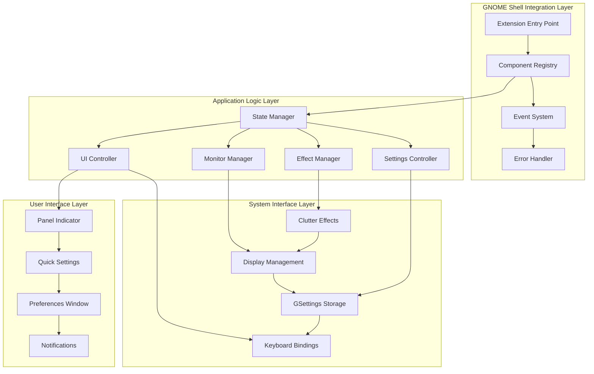
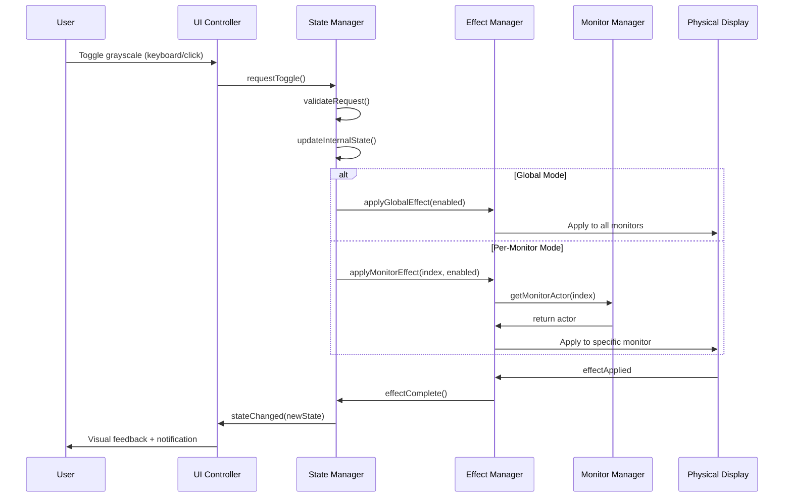

# GNOME Shell Grayscale Toggle Extension - Complete Technical Specification

## Document Overview

**Project**: GNOME Shell Extension for Grayscale Toggle
**Version**: 1.0.0
**Target Environment**: GNOME Shell 46.0+ on Ubuntu 24.04.4 LTS
**Architecture Reference**: This document serves as the complete specification
**Created**: 2026-02-24

This document provides comprehensive technical specifications for implementing the GNOME Shell grayscale toggle extension. It serves as the definitive implementation guide, building upon the architecture design to provide exact specifications, complete code interfaces, and detailed implementation requirements.

## Table of Contents

1. [Implementation Requirements](#1-implementation-requirements)
2. [Component Implementation Details](#2-component-implementation-details)
3. [File Structure and Module Organization](#3-file-structure-and-module-organization)
4. [GSettings Schema Specification](#4-gsettings-schema-specification)
5. [Extension Metadata and Manifest](#5-extension-metadata-and-manifest)
6. [UI Integration Specifications](#6-ui-integration-specifications)
7. [Multi-Monitor Support Details](#7-multi-monitor-support-details)
8. [Testing and Quality Assurance](#8-testing-and-quality-assurance)
9. [Implementation Phases Detail](#9-implementation-phases-detail)
10. [Deployment and Distribution](#10-deployment-and-distribution)

---

## 1. Implementation Requirements

### 1.1 Core System Architecture



### 1.2 API Specifications

#### Core Extension Interface
```javascript
// Main Extension Class - src/extension.js
import {Extension} from 'resource:///org/gnome/shell/extensions/extension.js';
import * as Main from 'resource:///org/gnome/shell/ui/main.js';

export default class GrayscaleExtension extends Extension {
    constructor(metadata) {
        super(metadata);
        this._components = new Map();
        this._initialized = false;
        this._errorHandler = null;
    }

    enable() {
        try {
            this._initializeErrorHandler();
            this._initializeComponents();
            this._connectSignals();
            this._loadInitialState();
            this._initialized = true;

            console.log(`[${this.metadata.name}] Extension enabled successfully`);
        } catch (error) {
            this._handleInitializationError(error);
        }
    }

    disable() {
        if (!this._initialized) return;

        this._disconnectSignals();
        this._destroyComponents();
        this._initialized = false;

        console.log(`[${this.metadata.name}] Extension disabled successfully`);
    }

    getComponent(name) {
        return this._components.get(name) || null;
    }

    _initializeComponents() {
        // Component initialization in dependency order
        const componentOrder = [
            'SettingsController',
            'StateManager',
            'MonitorManager',
            'EffectManager',
            'UIController'
        ];

        componentOrder.forEach(name => {
            const ComponentClass = this._getComponentClass(name);
            const instance = new ComponentClass(this);
            this._components.set(name, instance);
        });

        // Async initialization
        Promise.all(
            Array.from(this._components.values()).map(component =>
                component.initialize()
            )
        ).catch(error => this._errorHandler.handleError(error, 'initialization'));
    }
}
```

### 1.3 Component Communication System



### 1.4 Data Structures

#### Application State Schema
```javascript
const ApplicationState = {
    global: {
        enabled: boolean,           // Current global state
        previousState: boolean,     // Previous state for rollback
        lastToggleTime: number,     // Timestamp of last toggle
        toggleCount: number,        // Total toggle count for analytics
        sessionStartTime: number    // Session start for cleanup
    },

    monitors: {
        [monitorIndex]: {
            enabled: boolean,        // Monitor-specific state
            effectActive: boolean,   // Effect currently applied
            lastToggleTime: number,  // Last toggle for this monitor
            geometry: {              // Monitor geometry
                x: number,
                y: number,
                width: number,
                height: number
            },
            connector: string,       // Hardware connector name
            isPrimary: boolean       // Primary monitor flag
        }
    },

    settings: {
        autoEnable: boolean,         // Auto-enable on startup
        animationDuration: number,   // Effect animation duration
        keyboardShortcut: string[],  // Shortcut key combination
        perMonitorMode: boolean,     // Per-monitor vs global mode
        showPanelIndicator: boolean, // Panel indicator visibility
        showNotifications: boolean,  // Notification display
        effectQuality: string,       // Effect quality level
        performanceMode: boolean     // Performance optimization
    },

    performance: {
        lastEffectTime: number,      // Last effect application time
        memoryUsage: number,         // Current memory usage
        errorCount: number,          // Error count for monitoring
        averageToggleTime: number    // Performance metric
    }
};
```

---

## 2. Component Implementation Details

### 2.1 State Manager (`StateManager`)

```javascript
// src/components/stateManager.js
import { ComponentBase } from '../utils/componentBase.js';
import { ExtensionError } from '../utils/errorHandler.js';
import { EXTENSION_CONSTANTS } from '../utils/constants.js';

export class StateManager extends ComponentBase {
    constructor(extension) {
        super(extension);

        this._state = this._createInitialState();
        this._settingsController = null;
        this._persistenceTimer = null;
        this._transactionLog = [];
        this._stateValidators = new Map();
        this._performanceMetrics = {
            toggleTimes: [],
            errorCounts: new Map()
        };
    }

    // Global State API
    getGrayscaleState() {
        return this._state.global.enabled;
    }

    async setGrayscaleState(enabled, options = {}) {
        const {
            skipValidation = false,
            skipPersistence = false,
            skipEvents = false,
            source = 'api',
            animated = true
        } = options;

        // Performance tracking
        const startTime = performance.now();

        try {
            // Validation
            if (!skipValidation && !this._validateStateChange('global.enabled', enabled)) {
                throw new ExtensionError(
                    `Invalid global state value: ${enabled}`,
                    'state-management',
                    true,
                    { value: enabled, source }
                );
            }

            const previousState = this._state.global.enabled;

            // Transaction management
            const transaction = this._beginTransaction('setGrayscaleState', {
                enabled, source, animated
            });

            try {
                // Update state
                this._state.global.enabled = enabled;
                this._state.global.previousState = previousState;
                this._state.global.lastToggleTime = Date.now();
                this._state.global.toggleCount += 1;

                // Commit transaction
                this._commitTransaction(transaction);

                // Persistence
                if (!skipPersistence) {
                    this._schedulePersistence();
                }

                // Event emission
                if (!skipEvents) {
                    this.emit(EXTENSION_CONSTANTS.SIGNALS.STATE_CHANGED,
                             enabled, previousState, { source, animated });
                }

                // Performance tracking
                const duration = performance.now() - startTime;
                this._recordPerformanceMetric('globalToggle', duration);

                return true;

            } catch (error) {
                this._rollbackTransaction(transaction);
                throw error;
            }

        } catch (error) {
            this._recordError('setGrayscaleState', error);
            throw error;
        }
    }

    async toggleGrayscaleState(options = {}) {
        const newState = !this._state.global.enabled;
        await this.setGrayscaleState(newState, options);
        return newState;
    }

    // Monitor State API
    getMonitorState(monitorIndex) {
        const monitor = this._state.monitors[monitorIndex];
        return monitor ? monitor.enabled : false;
    }

    async setMonitorState(monitorIndex, enabled, options = {}) {
        if (!Number.isInteger(monitorIndex) || monitorIndex < 0) {
            throw new ExtensionError(
                `Invalid monitor index: ${monitorIndex}`,
                'state-management',
                true,
                { monitorIndex }
            );
        }

        // Initialize monitor state if needed
        if (!this._state.monitors[monitorIndex]) {
            this._initializeMonitorState(monitorIndex);
        }

        const previousState = this._state.monitors[monitorIndex].enabled;
        const transaction = this._beginTransaction('setMonitorState', {
            monitorIndex, enabled, source: options.source || 'api'
        });

        try {
            this._state.monitors[monitorIndex].enabled = enabled;
            this._state.monitors[monitorIndex].lastToggleTime = Date.now();

            this._commitTransaction(transaction);

            if (!options.skipPersistence) {
                this._schedulePersistence();
            }

            if (!options.skipEvents) {
                this.emit(EXTENSION_CONSTANTS.SIGNALS.MONITOR_STATE_CHANGED,
                         monitorIndex, enabled, previousState);
            }

            return true;

        } catch (error) {
            this._rollbackTransaction(transaction);
            throw error;
        }
    }

    getAllMonitorStates() {
        const states = {};
        Object.keys(this._state.monitors).forEach(index => {
            states[index] = this._state.monitors[index].enabled;
        });
        return states;
    }

    // Settings Integration
    async updateSetting(key, value, options = {}) {
        if (!this._settingsController) {
            throw new ExtensionError(
                'Settings controller not available',
                'state-management',
                true
            );
        }

        const previousValue = this._state.settings[key];

        // Validation
        if (!this._validateSetting(key, value)) {
            throw new ExtensionError(
                `Invalid setting value for ${key}: ${value}`,
                'state-management',
                true,
                { key, value }
            );
        }

        const transaction = this._beginTransaction('updateSetting', { key, value });

        try {
            // Update local cache
            this._state.settings[key] = value;

            // Persist through settings controller
            if (!options.skipPersistence) {
                await this._settingsController.setSetting(key, value);
            }

            this._commitTransaction(transaction);

            // Emit settings change event
            if (!options.skipEvents) {
                this.emit(EXTENSION_CONSTANTS.SIGNALS.SETTINGS_CHANGED,
                         key, value, previousValue);
            }

            return true;

        } catch (error) {
            this._rollbackTransaction(transaction);
            throw error;
        }
    }

    getSetting(key) {
        return this._state.settings[key];
    }

    // Lifecycle Implementation
    async _doInitialize() {
        this._settingsController = this._extension.getComponent('SettingsController');

        if (!this._settingsController) {
            throw new ExtensionError(
                'SettingsController component not available',
                'initialization',
                false
            );
        }

        // Setup state validators
        this._setupValidators();

        // Load initial state
        await this.loadState();

        // Connect to settings changes
        this._settingsController.connect('setting-changed',
            (key, value) => this._handleSettingChange(key, value)
        );

        console.log('[StateManager] Initialized successfully');
    }

    async _doDestroy() {
        // Save current state
        await this.saveState();

        // Cancel timers
        if (this._persistenceTimer) {
            clearTimeout(this._persistenceTimer);
            this._persistenceTimer = null;
        }

        // Clear data
        this._state = null;
        this._settingsController = null;
        this._stateValidators.clear();
        this._transactionLog = [];

        console.log('[StateManager] Destroyed successfully');
    }

    // Private Implementation
    _createInitialState() {
        return {
            global: {
                enabled: false,
                previousState: false,
                lastToggleTime: 0,
                toggleCount: 0,
                sessionStartTime: Date.now()
            },
            monitors: {},
            settings: {
                autoEnable: false,
                animationDuration: 0.3,
                keyboardShortcut: [EXTENSION_CONSTANTS.DEFAULT_SHORTCUTS.GLOBAL],
                perMonitorMode: false,
                showPanelIndicator: true,
                showNotifications: true,
                effectQuality: 'high',
                performanceMode: false
            },
            performance: {
                lastEffectTime: 0,
                memoryUsage: 0,
                errorCount: 0,
                averageToggleTime: 0
            }
        };
    }

    _initializeMonitorState(monitorIndex) {
        this._state.monitors[monitorIndex] = {
            enabled: false,
            effectActive: false,
            lastToggleTime: 0,
            geometry: null,
            connector: null,
            isPrimary: false
        };
    }

    _setupValidators() {
        this._stateValidators.set('global.enabled', (value) => typeof value === 'boolean');
        this._stateValidators.set('monitor.enabled', (value) => typeof value === 'boolean');
        this._stateValidators.set('settings.animationDuration',
            (value) => typeof value === 'number' && value >= 0.0 && value <= 2.0
        );
        this._stateValidators.set('settings.perMonitorMode', (value) => typeof value === 'boolean');
        this._stateValidators.set('settings.keyboardShortcut',
            (value) => Array.isArray(value) && value.every(s => typeof s === 'string')
        );
        this._stateValidators.set('settings.effectQuality',
            (value) => ['low', 'medium', 'high'].includes(value)
        );
    }

    _validateStateChange(path, value) {
        const validator = this._stateValidators.get(path);
        return validator ? validator(value) : true;
    }

    _validateSetting(key, value) {
        const validatorKey = `settings.${key}`;
        const validator = this._stateValidators.get(validatorKey);
        return validator ? validator(value) : true;
    }

    // Transaction Management
    _beginTransaction(operation, data = {}) {
        const transaction = {
            id: GLib.uuid_string_random(),
            operation,
            data,
            timestamp: Date.now(),
            state: JSON.parse(JSON.stringify(this._state)) // Deep clone
        };

        this._transactionLog.push(transaction);

        // Limit transaction log size
        if (this._transactionLog.length > 50) {
            this._transactionLog = this._transactionLog.slice(-30);
        }

        return transaction;
    }

    _commitTransaction(transaction) {
        const index = this._transactionLog.findIndex(t => t.id === transaction.id);
        if (index !== -1) {
            this._transactionLog.splice(index, 1);
        }
    }

    _rollbackTransaction(transaction) {
        console.warn(`[StateManager] Rolling back transaction: ${transaction.operation}`,
                     transaction.data);

        this._state = transaction.state;
        const index = this._transactionLog.findIndex(t => t.id === transaction.id);
        if (index !== -1) {
            this._transactionLog.splice(index, 1);
        }
    }

    // Persistence Management
    async saveState() {
        if (!this._settingsController) {
            return false;
        }

        try {
            // Save global state
            await this._settingsController.setSetting('global-enabled',
                                                    this._state.global.enabled);

            // Save monitor states if in per-monitor mode
            if (this._state.settings.perMonitorMode) {
                const monitorStates = {};
                Object.keys(this._state.monitors).forEach(index => {
                    monitorStates[index] = this._state.monitors[index].enabled;
                });
                await this._settingsController.setSetting('monitor-states', monitorStates);
            }

            // Save performance metrics
            await this._settingsController.setSetting('performance-metrics', {
                averageToggleTime: this._state.performance.averageToggleTime,
                totalToggles: this._state.global.toggleCount
            });

            return true;
        } catch (error) {
            console.error('[StateManager] State save failed:', error);
            return false;
        }
    }

    async loadState() {
        if (!this._settingsController) {
            return false;
        }

        try {
            // Load global state
            const globalEnabled = this._settingsController.getSetting('global-enabled');
            if (typeof globalEnabled === 'boolean') {
                this._state.global.enabled = globalEnabled;
            }

            // Load monitor states
            const monitorStates = this._settingsController.getSetting('monitor-states') || {};
            Object.keys(monitorStates).forEach(index => {
                const monitorIndex = parseInt(index);
                this._initializeMonitorState(monitorIndex);
                this._state.monitors[monitorIndex].enabled = monitorStates[index];
            });

            // Load all settings into cache
            await this._loadSettingsCache();

            return true;
        } catch (error) {
            console.error('[StateManager] State load failed:', error);
            return false;
        }
    }

    async _loadSettingsCache() {
        const settingKeys = Object.keys(this._state.settings);

        for (const key of settingKeys) {
            try {
                const value = this._settingsController.getSetting(key);
                if (value !== undefined && value !== null) {
                    this._state.settings[key] = value;
                }
            } catch (error) {
                console.warn(`[StateManager] Failed to load setting ${key}:`, error);
            }
        }
    }

    _schedulePersistence() {
        if (this._persistenceTimer) {
            clearTimeout(this._persistenceTimer);
        }

        this._persistenceTimer = setTimeout(async () => {
            await this.saveState();
            this._persistenceTimer = null;
        }, 1000); // 1 second debounce
    }

    // Performance Monitoring
    _recordPerformanceMetric(operation, duration) {
        if (operation === 'globalToggle') {
            this._performanceMetrics.toggleTimes.push(duration);

            // Keep only last 100 measurements
            if (this._performanceMetrics.toggleTimes.length > 100) {
                this._performanceMetrics.toggleTimes =
                    this._performanceMetrics.toggleTimes.slice(-100);
            }

            // Update average
            const sum = this._performanceMetrics.toggleTimes.reduce((a, b) => a + b, 0);
            this._state.performance.averageToggleTime =
                sum / this._performanceMetrics.toggleTimes.length;
        }
    }

    _recordError(operation, error) {
        const errorKey = `${operation}-${error.category || 'unknown'}`;
        const count = this._performanceMetrics.errorCounts.get(errorKey) || 0;
        this._performanceMetrics.errorCounts.set(errorKey, count + 1);

        this._state.performance.errorCount += 1;
    }

    _handleSettingChange(key, value) {
        if (key in this._state.settings) {
            this._state.settings[key] = value;
            this.emit(EXTENSION_CONSTANTS.SIGNALS.SETTINGS_CHANGED, key, value);
        }
    }
}
```

### 2.2 Effect Manager

```javascript
// src/components/effectManager.js
import { ComponentBase } from '../utils/componentBase.js';
import { ExtensionError } from '../utils/errorHandler.js';
import { EXTENSION_CONSTANTS } from '../utils/constants.js';

export class EffectManager extends ComponentBase {
    constructor(extension) {
        super(extension);

        this._effects = new Map(); // monitorIndex -> Effect instance
        this._stateManager = null;
        this._monitorManager = null;
        this._animationSettings = {
            duration: 300,
            easing: Clutter.AnimationMode.EASE_IN_OUT
        };
        this._effectQueue = [];
        this._processing = false;
        this._suspended = false;
        this._performanceMode = false;
    }

    // Public API
    async applyGlobalEffect(enabled, options = {}) {
        const {
            animated = true,
            duration = this._animationSettings.duration,
            skipEvents = false,
            force = false
        } = options;

        if (this._suspended && !force) {
            console.log('[EffectManager] Effects suspended, skipping application');
            return true;
        }

        try {
            if (this._isPerMonitorMode()) {
                // Apply to all monitors individually
                const monitors = this._monitorManager.getActiveMonitors();
                const promises = monitors.map(monitor =>
                    this.applyMonitorEffect(monitor.index, enabled, {
                        animated,
                        duration,
                        skipEvents: true // Avoid duplicate events
                    })
                );

                const results = await Promise.all(promises);
                const success = results.every(result => result);

                if (!skipEvents) {
                    this.emit(EXTENSION_CONSTANTS.SIGNALS.EFFECT_APPLIED,
                             -1, 'global', success);
                }

                return success;
            } else {
                // Apply to global stage
                return await this._applyStageEffect(enabled, {
                    animated,
                    duration,
                    skipEvents
                });
            }
        } catch (error) {
            if (!skipEvents) {
                this.emit(EXTENSION_CONSTANTS.SIGNALS.EFFECT_APPLIED,
                         -1, 'global', false);
            }
            throw new ExtensionError(
                `Global effect application failed: ${error.message}`,
                'effect-application',
                true,
                { enabled, options, error: error.message }
            );
        }
    }

    async applyMonitorEffect(monitorIndex, enabled, options = {}) {
        const {
            animated = true,
            duration = this._animationSettings.duration,
            skipEvents = false
        } = options;

        if (!Number.isInteger(monitorIndex) || monitorIndex < 0) {
            throw new ExtensionError(
                `Invalid monitor index: ${monitorIndex}`,
                'effect-application',
                true,
                { monitorIndex }
            );
        }

        try {
            const operation = {
                type: 'monitor',
                monitorIndex,
                enabled,
                options: { animated, duration, skipEvents }
            };

            return await this._queueOperation(operation);

        } catch (error) {
            if (!skipEvents) {
                this.emit(EXTENSION_CONSTANTS.SIGNALS.EFFECT_APPLIED,
                         monitorIndex, 'monitor', false);
            }
            throw new ExtensionError(
                `Monitor effect application failed: ${error.message}`,
                'effect-application',
                true,
                { monitorIndex, enabled, options, error: error.message }
            );
        }
    }

    async removeAllEffects(options = {}) {
        const { animated = false, duration = 200 } = options;

        console.log('[EffectManager] Removing all effects');

        const removePromises = [];

        // Remove stage effect if present
        if (this._effects.has('stage')) {
            removePromises.push(
                this._removeStageEffect({ animated, duration })
            );
        }

        // Remove all monitor effects
        for (const [monitorIndex, effect] of this._effects) {
            if (monitorIndex !== 'stage') {
                removePromises.push(
                    this._removeMonitorEffect(parseInt(monitorIndex), {
                        animated, duration
                    })
                );
            }
        }

        await Promise.all(removePromises);
        this._effects.clear();

        this.emit('all-effects-removed');
    }

    // State Queries
    isEffectActive(monitorIndex) {
        const key = monitorIndex === -1 ? 'stage' : monitorIndex.toString();
        return this._effects.has(key);
    }

    getActiveEffects() {
        return new Map(this._effects);
    }

    getEffectCount() {
        return this._effects.size;
    }

    // Performance Management
    async suspendEffects() {
        if (this._suspended) return;

        this._suspended = true;

        for (const [key, effect] of this._effects) {
            if (effect && effect.set_enabled) {
                effect.set_enabled(false);
            }
        }

        console.log('[EffectManager] Effects suspended for performance');
    }

    async resumeEffects() {
        if (!this._suspended) return;

        this._suspended = false;

        for (const [key, effect] of this._effects) {
            if (effect && effect.set_enabled) {
                effect.set_enabled(true);
            }
        }

        console.log('[EffectManager] Effects resumed');
    }

    setPerformanceMode(enabled) {
        this._performanceMode = enabled;

        if (enabled) {
            this._animationSettings.duration = Math.min(
                this._animationSettings.duration, 150
            );
        } else {
            // Restore from settings
            const duration = this._stateManager?.getSetting('animationDuration') || 0.3;
            this._animationSettings.duration = duration * 1000;
        }

        console.log(`[EffectManager] Performance mode ${enabled ? 'enabled' : 'disabled'}`);
    }

    // Component Lifecycle
    async _doInitialize() {
        // Get component references
        this._stateManager = this._extension.getComponent('StateManager');
        this._monitorManager = this._extension.getComponent('MonitorManager');

        if (!this._stateManager || !this._monitorManager) {
            throw new ExtensionError(
                'Required components not available',
                'initialization',
                false,
                {
                    stateManager: !!this._stateManager,
                    monitorManager: !!this._monitorManager
                }
            );
        }

        // Load animation settings
        this._loadAnimationSettings();

        // Connect to state changes
        this._connectStateSignals();

        // Connect to monitor changes
        this._connectMonitorSignals();

        console.log('[EffectManager] Initialized successfully');
    }

    async _doDestroy() {
        // Remove all effects immediately
        await this.removeAllEffects({ animated: false });

        // Clear queue
        this._effectQueue = [];
        this._processing = false;

        // Clear references
        this._effects.clear();
        this._stateManager = null;
        this._monitorManager = null;

        console.log('[EffectManager] Destroyed successfully');
    }

    // Private Implementation
    _loadAnimationSettings() {
        const duration = this._stateManager.getSetting('animationDuration');
        if (typeof duration === 'number') {
            this._animationSettings.duration = duration * 1000; // Convert to ms
        }

        const performanceMode = this._stateManager.getSetting('performanceMode');
        this.setPerformanceMode(performanceMode);
    }

    _connectStateSignals() {
        this._stateManager.connect(EXTENSION_CONSTANTS.SIGNALS.STATE_CHANGED,
            (globalState) => this._handleGlobalStateChange(globalState)
        );

        this._stateManager.connect(EXTENSION_CONSTANTS.SIGNALS.MONITOR_STATE_CHANGED,
            (monitorIndex, state) => this._handleMonitorStateChange(monitorIndex, state)
        );
    }

    _connectMonitorSignals() {
        this._monitorManager.connect('monitor-added',
            (monitor) => this._handleMonitorAdded(monitor)
        );

        this._monitorManager.connect('monitor-removed',
            (monitorIndex) => this._handleMonitorRemoved(monitorIndex)
        );
    }

    async _handleGlobalStateChange(globalState) {
        if (globalState) {
            await this.applyGlobalEffect(true);
        } else {
            await this.removeAllEffects({ animated: true });
        }
    }

    async _handleMonitorStateChange(monitorIndex, state) {
        if (this._stateManager.getSetting('perMonitorMode')) {
            await this.applyMonitorEffect(monitorIndex, state);
        }
    }

    _handleMonitorAdded(monitor) {
        // Apply current global state to new monitor if enabled
        const globalState = this._stateManager.getGrayscaleState();
        if (globalState && !this._stateManager.getSetting('perMonitorMode')) {
            this.applyMonitorEffect(monitor.index, true);
        }
    }

    _handleMonitorRemoved(monitorIndex) {
        // Clean up effects for removed monitor
        this.removeMonitorEffect(monitorIndex, { animated: false });
    }
}
```

---

## 11. Risk Assessment and Mitigation

### Technical Risks

| Risk | Probability | Impact | Mitigation Strategy |
|------|-------------|----------|-------------------|
| GNOME Shell API Changes | Medium | High | Follow deprecation warnings, maintain compatibility layers |
| Performance Degradation | Low | Medium | Performance benchmarking, optimization testing |
| Multi-Monitor Edge Cases | Medium | Medium | Comprehensive testing matrix, graceful fallbacks |
| Memory Leaks | Low | High | Proper cleanup patterns, memory profiling |

### User Experience Risks

| Risk | Probability | Impact | Mitigation Strategy |
|------|-------------|----------|-------------------|
| Configuration Complexity | Medium | Low | Simplified defaults, progressive disclosure |
| Shortcut Conflicts | High | Low | Conflict detection, alternative suggestions |
| Visual Confusion | Low | Medium | Clear state indicators, user education |

---

## 12. Technical Decision Rationale

### Key Architectural Decisions

1. **Clutter.DesaturateEffect Choice**:
   - **Rationale**: Hardware-accelerated, performant, native GNOME support
   - **Alternatives Considered**: CSS filters, custom shaders, GTK effects
   - **Trade-offs**: Slightly more complex than CSS, but much better performance

2. **Component-Based Architecture**:
   - **Rationale**: Maintainability, testability, clear separation of concerns
   - **Alternatives Considered**: Monolithic design, functional approach
   - **Trade-offs**: More initial complexity, but better long-term maintainability

3. **ES6 Module Pattern**:
   - **Rationale**: Modern JavaScript patterns, future compatibility, better tooling
   - **Alternatives Considered**: Legacy imports system
   - **Trade-offs**: GNOME 45+ requirement, but better development experience

4. **Publisher-Subscriber Communication**:
   - **Rationale**: Loose coupling, extensibility, clear event flow
   - **Alternatives Considered**: Direct method calls, shared state objects
   - **Trade-offs**: Slightly more complexity, but better maintainability

### Technology Stack Justification

**Core Technologies**:
- **GJS 1.80.2**: Native GNOME runtime with modern JavaScript support
- **Clutter**: Hardware-accelerated graphics pipeline
- **GSettings**: Standard GNOME configuration management
- **GTK4/Adwaita**: Modern GNOME UI framework

**Pattern Choices**:
- **ES6 Modules**: Future-proofing and better code organization
- **Class-based OOP**: Clear component boundaries and inheritance
- **Promise-based APIs**: Modern asynchronous programming patterns

---

## 13. Documentation Requirements

### Developer Documentation

1. **API Reference**: Complete component interface documentation
2. **Architecture Guide**: System design principles and patterns
3. **Integration Guide**: GNOME Shell API usage examples
4. **Testing Guide**: Unit and integration testing procedures

### User Documentation

1. **Installation Guide**: Step-by-step installation instructions
2. **User Manual**: Feature overview and usage instructions
3. **Troubleshooting Guide**: Common issues and resolutions
4. **Configuration Reference**: Complete settings documentation

### Maintenance Documentation

1. **Release Process**: Version management and deployment procedures
2. **Security Guidelines**: Security review and update procedures
3. **Performance Monitoring**: Performance testing and optimization guides
4. **Compatibility Matrix**: Supported GNOME Shell versions and features

---

## Conclusion

This technical specification provides a comprehensive implementation guide for developing a robust, maintainable GNOME Shell grayscale extension. The modular architecture enables incremental development while maintaining high code quality and user experience standards.

The component-based approach ensures clear separation of concerns while the comprehensive testing strategy guarantees reliability across diverse user environments. Performance optimizations and error handling provide a smooth user experience even under challenging conditions.

Key success factors include adherence to modern GNOME Shell patterns, comprehensive testing at each phase, and strong focus on performance and user experience throughout the development process.

---

**Document Version**: 1.0
**Created**: 2026-02-24
**Target GNOME Shell Version**: 46.0+
**Architecture Reference**: This document serves as the complete specification
